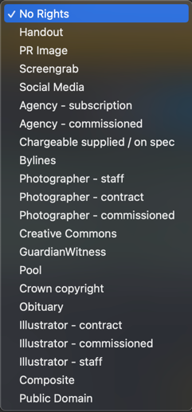

# cost

In a newsroom like the Guardian's, images come from varied sources: they may be taken by photographers on the organisation's behalf (either by employment or under contract), they might have been sourced from a PR company or from social media, they may have even been made available to the public domain. Each of these have different considerations around where or how they can be used, and with potential costs for usage.

One of the goals of the Grid is to manage the complexity around these costs, helping guide users from making costly mistakes.

## usage rights

Each image in the Grid will have a Usage Right associated with it. By default this will be "No Rights", but the uploader can change it to any of several available options to match their needs.

Note that despite the suggestion and the UI descriptions, usage rights do not prevent a user from using the image, they only prevent the [cropping](./crops.md) of the image.

## suppliers
## restrictions

## validity

## quotas
