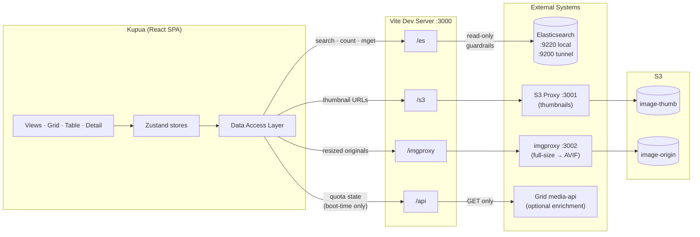

# Kupua (kʊˈpʊ.wə)

**Modern frontend WIP PROPOSAL for [Grid](https://github.com/guardian/grid)** – the Guardian's image DAM. Or just a plaything, really.

Kupua  is a React-based replacement for Kahuna (AngularJS). It lives inside the Grid monorepo and connects directly to Elasticsearch – either a local instance with sample data, or real Guardian ES clusters via SSH tunnel.

Kupua is also a supernatural shape-shifting being from Hawaiian mythology, usually of cruel and vindictive character, ready to destroy and devour any persons they can catch, oftentimes of kindly spirit giving watchful care to others. One time a man, a vegetable, an animal or a mineral form.

Kupua is also written entirely using Claude Opus 4.6 shamelessly reusing work of every human who worked on Grid over the years, including those who forked it. And everyone else who ever used the internet.

<br>

## Quick Start

### Local mode (sample data)

```bash
./kupua/scripts/start.sh
```

Starts a local ES on port 9220, loads 10k sample images, and opens at **http://localhost:3000**.

### TEST mode (real data)

```bash
./kupua/scripts/start.sh --use-TEST
```

Connects to the Guardian's TEST Elasticsearch cluster via SSH tunnel. Requires:

- **AWS CLI v2** – `brew install awscli`
- **Session Manager Plugin** – `brew install session-manager-plugin`
- **Janus credentials** – you need the `media-service` AWS profile. Fetch credentials from [Janus](https://janus.gutools.co.uk) before running.
- **`ssm`** _(optional)_ – [ssm-scala](https://github.com/guardian/ssm-scala) is used if available, otherwise the script falls back to raw AWS CLI. Guardian devs likely have it already.

TEST mode automatically:
1. Establishes an SSH tunnel to TEST ES (port 9200)
2. Discovers the live index alias
3. Starts an **S3 thumbnail proxy** (port 3001) – proxies thumbnail requests using your AWS credentials
4. Starts **imgproxy** (port 3002) – resizes full-size originals from S3 on the fly
5. Enables **write protection** – only read operations (`_search`, `_count`, `_cat/aliases`) are allowed against the real cluster
6. Starts the Vite dev server on port 3000

All image access is read-only and uses your existing developer AWS credentials. See `exploration/docs/infra-safeguards.md` for the full safety framework.

### Options

```bash
./kupua/scripts/start.sh --use-TEST      # Runs in (some) TEST data
./kupua/scripts/start.sh --skip-es       # Skip starting Elasticsearch
./kupua/scripts/start.sh --skip-data     # Skip sample data check
./kupua/scripts/start.sh --skip-install  # Skip npm install check
```

## Prerequisites

### Local mode (everyone)

- **Docker** (with Compose) – `brew install --cask docker` or [Docker Desktop](https://www.docker.com/products/docker-desktop/). Both Compose v2 (`docker compose`) and v1 (`docker-compose`) are supported.
- **Node.js** `^20.19.0` or `≥22.12.0` – `brew install node` or use `nvm use` (`.nvmrc` provided)
- **Python 3** – used by the sample data loader. macOS includes it; check with `python3 --version`
- **Sample data** – `kupua/exploration/mock/sample-data.ndjson` (115MB, not in git). Ask a team member or check S3.

> **First run?** The ES Docker image is ~1.3GB — first `docker compose up` may take a few minutes to download.

### TEST mode (adds)

- **AWS CLI v2** – `brew install awscli`
- **Session Manager Plugin** – `brew install session-manager-plugin`
- **Janus credentials** – `media-service` AWS profile
- **`ssm-scala`** _(optional)_ – used if available, otherwise falls back to raw AWS CLI

### Quick dependency check

```bash
node -v                         # ^20.19.0 || >=22.12.0
docker compose version          # v2.x
python3 --version               # 3.x
aws --version                   # (TEST mode only)
session-manager-plugin          # (TEST mode only — prints version)
```

## Manual Setup (if you prefer)

```bash
# 1. Start Elasticsearch
cd kupua && docker compose up -d

# 2. Load sample data
./kupua/scripts/load-sample-data.sh

# 3. Install dependencies
cd kupua && npm install

# 4. Start dev server
cd kupua && npm run dev
```

## Stopping

```bash
# Stop the dev server: Ctrl+C
# (In TEST mode, this also stops the S3 proxy)

# Stop Elasticsearch / imgproxy
cd kupua && docker compose down

# Stop ES and remove data volume (full reset)
cd kupua && docker compose down -v
```

## Architecture



## Isolation from Grid

Kupua is fully isolated from the main Grid application:

- **Separate Elasticsearch** – port 9220 (Grid uses 9200), separate Docker container (`kupua-elasticsearch`), separate data volume (`kupua-es-data`)
- **No writes to real clusters** – TEST mode enforces read-only access at the adapter level
- **Independent start** – `start.sh` does not interfere with Grid's `dev/script/start.sh`
- **Separate npm** – own `package.json`, own `node_modules`

## Developing with local media-api

To develop features that talk to Grid's media-api (e.g. the media-api gap closure work),
you need Grid running locally alongside Kupua. The Vite dev server proxies `/api/...`
to `https://api.media.local.dev-gutools.co.uk` automatically — no Kupua config change needed.

**One-time setup:** `dev/nginx-mappings.yml.template` in the Grid repo needs a Kupua entry.
Add the following to the mappings list (it is **not** in the committed version):

```yaml
- prefix: kupua.media
  port: 3000
```

Then run `dev-nginx setup-app dev/nginx-mappings.yml.template` from the Grid root (or re-run
`dev/script/setup.sh`) to apply it. Kupua will then also be available at
`https://kupua.media.local.dev-gutools.co.uk`.

**Authentication:** Visit `https://media.test.dev-gutools.co.uk` to get the cookie needed for eg. Collections tree.

**To run the minimum Grid services needed** (from Grid repo root):

```bash
dev/script/setup.sh                  # provisions Docker, localstack, nginx, config
dev/script/start.sh --use-TEST       # starts auth + media-api with TEST domain config
```

## Key Documentation

- **[AGENTS.md](AGENTS.md)** – agent context: system summary, architecture decisions, context routing, current phase
- **[Scroll Architecture](exploration/docs/00%20Architecture%20and%20philosophy/03-scroll-architecture.md)** – three-tier scroll system (scroll/indexed/seek), windowed buffer, swimming
- **[Frontend Philosophy](exploration/docs/00%20Architecture%20and%20philosophy/01-frontend-philosophy.md)** – density continuum, "Never Lost", interaction patterns
- **[Selections Architecture](exploration/docs/00%20Architecture%20and%20philosophy/05-selections.md)** – multi-image selection, click semantics, reconciliation
- **[Component Detail](exploration/docs/00%20Architecture%20and%20philosophy/component-detail.md)** – per-component/hook technical reference
- **[Deviations](exploration/docs/deviations.md)** – intentional differences from Grid/kahuna
- **[Safeguards](exploration/docs/infra-safeguards.md)** – Elasticsearch & S3 safety documentation

## Current Status

**Phase 2 – Live Elasticsearch (Read-Only)**

Grid/table views with three-tier scroll architecture (≤1k/1k–65k/>65k), multi-image selection, CQL search, keyboard navigation, touch gestures and mobile view, image detail with zoom. Connected to real ES clusters via SSH tunnel. See [AGENTS.md](AGENTS.md) for full details.
