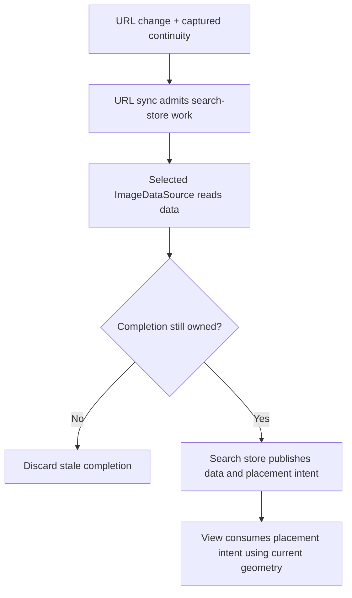

# State Management in Kupua

Kupua is a React Grid client prototype using Zustand and TanStack Router/Table/Virtual.
Its state model supports browsing an ordered result set without tying the data's
lifetime to the currently mounted view. This describes the implementation today,
not a proposed replacement architecture.

## The Product Constraints

Compared with [Kahuna's offset-addressed thumbnail results](../../../../kahuna/public/js/search/results.js#L223), capped at 100,000,
Kupua supports arbitrary-position browsing across millions through a custom
scrubber and bounded result window. Moving the scrubber can request a distant
window; it is not simply scrolling already-loaded DOM rows.

Kupua also adds a metadata-table presentation alongside the thumbnail grid.
These are views of the same search, not separate result sets. "Density" means the
grid/table preference; detail and fullscreen reuse the browsing context. Changing
presentation should not discard a pending browsing destination.

Focus (optional), selection and viewport position are separate. Focus is one image used for
keyboard/traversal continuity, potentially outside the loaded window. Selection
is a set of ticked IDs. The visible viewport can move independently of both; an
image near its centre can supply a fallback anchor. Preservation policy varies
by transition, rather than promising identical placement everywhere.

## State Owners

| Responsibility | Owner and boundary |
|---|---|
| Search/detail intent | TanStack Router's URL parameters. [URL sync](../../../src/hooks/useUrlSearchSync.ts) canonicalizes them, mirrors search parameters into Zustand and admits searches. The displayed image is URL state; density is not. |
| Browsing data and work | [Search store](../../../src/stores/search-store.ts): results, global buffer offset, total, ID-to-position lookup, cursors, focus, seek/restore intent and asynchronous ownership. It also contains polling, facet caches and sort distributions; it is not a narrowly isolated result cache. |
| Selection and summaries | [Selection store](../../../src/stores/selection-store.ts): selected IDs, range anchor, bounded metadata cache, hydration and reconciliation. Membership does not depend on resident rows. Sort/density changes preserve it; new search/Home clears it by default. |
| Server-computed fields | [Enrichment store](../../../src/stores/enrichment-store.ts): per-image API overlays for committed search results. Standalone detail keeps its overlay in the component's requested-ID-bound state instead. |
| Viewport and presentation | [Data window](../../../src/hooks/useDataWindow.ts) exposes indexed access and visible-range reporting; [scroll effects](../../../src/hooks/useScrollEffects.ts) applies placement to the virtualizer/DOM. Components and hooks retain local disclosure, gesture and pending-presentation state. |

Zustand is not the whole state system. Module-scoped controllers, generation
counters, pending handoffs and caches coexist with store state. Geometry/container
refs bridge imperative consumers; visible-range observations have their own
external-store subscription. React selector subscriptions, imperative `getState()`
reads and local refs serve different notification needs.

## From Intent to Pixels

**Ordinary query/sort transition.** This is a schematic of an accepted read path,
not every request, failure or navigation branch.

URL sync replaces URL-managed store parameters, including clearing removed values;
detail-only navigation does not admit a new search. The datasource is either
media-api or direct ES, not a viewport owner. Cancellation/generation checks guard
publication of results, positions, cursors and contributing API enrichment.
Supplied server fields override local fallbacks; absent overlay fields retain them.
**Data arrival, accepted publication and presentation completion are distinct.**

Ordinary searches use three result-count regimes: small sets fill to residency,
intermediate sets use global virtual coordinates with a background position map,
and large sets seek between bounded windows. The map accelerates lookup; it is
not permission to render. AI results instead form a finite loaded pool with local
sorting. These are different data strategies behind the browsing experience.

Cancellation is consequently not one global reset. A density change may cancel a
view-owned refill or obsolete placement while a useful search or user-requested
destination continues. Selection-range work has its own membership/anchor owner.
Unlike [Kahuna's loaded-image range selection](../../../../kahuna/public/js/search/results.js#L759), Kupua can walk IDs between unloaded
endpoints; fetching metadata and accepting membership are separate operations.

## Identity and Persistence

Three identities must not be conflated:

- `buildSearchKey`: query/sort/filter fingerprint, excluding image display and
  pagination fields. Used to qualify cached positions and continuity.
- `kupuaKey`: one browser-history entry. Two entries can have identical search
  parameters but different represented positions.
- Request generations, abort signals and action owners: whether asynchronous
  work still has authority to publish. Matching query text alone is insufficient.

[Kahuna's scroll-position service](../../../../kahuna/public/js/services/scroll-position.js#L18)
records a pixel offset; Kupua additionally represents
history destinations with image identity, offset and viewport-relative placement.
Back/reload reconstruction fetches current data: it is not replay of an immutable
result snapshot. API mode does not currently open a PIT.

The URL is shareable intent, not a session dump. Per-tab `sessionStorage` retains
history snapshots, detail cursor/offset hints, density, selection IDs/anchor and
collection cache data. Selection persistence is debounced, not transactional;
metadata and reconciliation are rebuilt. Browser-local `localStorage` holds panel,
column and interaction preferences. Result buffers, request owners and enrichment
are runtime state. Storage failure degrades these conveniences, not authorization.

## Engineering Consequence

Read an operation's producer, acceptance guard and presentation consumer together.
Changing a store field is not necessarily a complete state transition. The current
architecture's strength is preserving distinct lifetimes; its cost is coordination
spread across stores, hooks and module state. A new global epoch or another store
does not by itself simplify that coordination.

For exact contracts, use [focus/position](02-focus-and-position-preservation.md),
[history](04-browser-history-architecture.md), [selection](05-selections.md) and
the [component reference](component-detail.md).