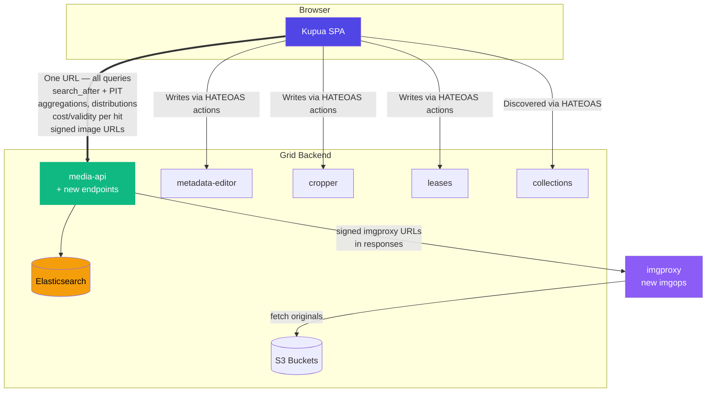
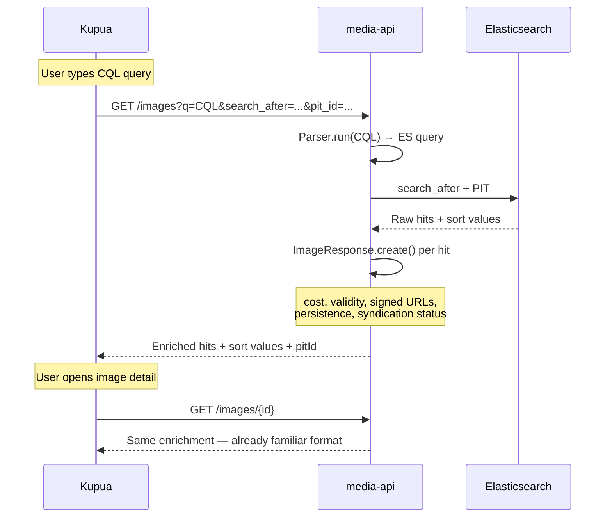

# Kupua–Grid API-First Integration Plan

*For engineer review — produced April 2026*

> **Alternative to:** `integration-plan.md` (direct-ES plan, zero media-api changes).
>
> **Core thesis:** Kupua should be a HATEOAS client that takes **one config value**
> — the media-api root URL — and discovers everything else via links. No direct
> ES, S3, or internal service access. All media-api changes are **additive** —
> existing endpoints, responses, and behaviour are unchanged. Legacy clients
> (kahuna, API consumers) are unaffected.

---

## Table of Contents

1. [Why API-First](#why-api-first)
2. [Design Principles](#design-principles)
3. [What media-api Gains (All Additive)](#what-media-api-gains-all-additive)
4. [What Kupua Loses](#what-kupua-loses)
5. [What Kupua Keeps](#what-kupua-keeps)
6. [Phased Plan](#phased-plan)
7. [Detailed Endpoint Specifications](#detailed-endpoint-specifications)
8. [Performance Analysis](#performance-analysis)
9. [imgproxy as Grid Infrastructure (Parallel Workstream)](#imgproxy-as-grid-infrastructure)
10. [Hybrid Path: Start Direct-ES, Migrate to API-First](#hybrid-path)
11. [Comparison with Direct-ES Plan](#comparison-with-direct-es-plan)
12. [Open Questions](#open-questions)

---
### Architecture



### Data Flow — Search



## Why API-First

### The architectural argument

Today, kupua talks directly to Elasticsearch — it knows index names, field
paths, query DSL, sort clause construction, PIT lifecycle, and S3 bucket
paths. This makes it fast to develop in isolation but architecturally wrong:

1. **Not portable.** Any Grid operator (eelpie's Kubernetes fork, BBC, future
   deployments) needs kupua's S3 proxy, imgproxy, ES tunnel, and Docker
   infrastructure. The frontend knows too much about the backend.

2. **Duplicated logic.** Cost calculation, validity checks, persistence
   reasons, `is:` filter translations, and syndication status all live in
   Scala. The direct-ES plan requires replicating them in TypeScript — a
   maintenance burden that drifts over time.

3. **Signed URLs.** media-api already generates signed S3/CloudFront URLs
   for thumbnails and sources via `ImageResponse.create()`. Kupua bypasses
   this with a dev-only S3 proxy — not viable in production.

4. **The HATEOAS surface exists.** `GET /` returns links to every Grid
   service. `GET /images/{id}` returns cost, validity, persistence, signed
   URLs, HATEOAS links to crops/edits/usages/leases, and permission-gated
   actions. The API is already 80% of what a frontend needs.

### The eelpie argument

An external Grid fork operator (eelpie) runs Grid on Kubernetes in production.
His position: the frontend should know one URL and follow links. He has a
[full HATEOAS test suite](https://github.com/eelpie/grid-api-tests) proving
this works. He's been contributing PRs (e.g. grid#4531) to improve media-api's
link surface. He cannot run kahuna locally because `KahunaConfig extends
CommonConfig` requires AWS credentials, Kinesis, DynamoDB, S3 — just to
render a UI. He wants: `MEDIA_API_URL=https://my-grid.example.com` and nothing
else.

### The additive principle

**Every change in this plan is additive.** No existing endpoint signature
changes. No existing response field is removed or renamed. New query parameters
are optional with backwards-compatible defaults. New endpoints are new routes.
Existing clients (kahuna, API consumers, eelpie's test suite) see no difference.
The old `from/size` pagination continues to work exactly as before. New
capabilities are opt-in.

---

## Design Principles

1. **Additive only.** No breaking changes to media-api. Legacy clients unaffected.
2. **One URL.** Kupua's sole config: the media-api root. Everything else discovered.
3. **Backend owns queries.** CQL parsing, ES query construction, filter logic,
   cost/validity computation — all stay in Scala. Frontend sends CQL strings, gets
   enriched results.
4. **Frontend owns UX.** Windowed buffer, virtualisation, scrubber, density
   continuum, keyboard navigation — all stay in React/TypeScript.
5. **Phase independence.** Each phase delivers standalone value. Phases can be
   reordered or deferred without blocking others.
6. **Performance parity.** API-first must not regress kupua's scroll/seek
   performance. Where raw ES was faster, the API must expose equivalent
   primitives.

---

## What media-api Gains (All Additive)

### New endpoints

| # | Endpoint | Purpose | Effort |
|---|----------|---------|--------|
| 1 | `POST /images/pit` | Open a Point In Time snapshot | S |
| 2 | `DELETE /images/pit/{pitId}` | Close a PIT | S |
| 3 | `GET /images/count` | Lightweight doc count (no hits) | S |
| 4 | `GET /images/aggregations` | Batched terms aggregations | M |
| 5 | `GET /images/aggregations/distribution` | Composite agg for sort distributions | M |
| 6 | `GET /images/aggregations/percentile` | Percentile estimation for deep seek | S |
| 7 | `GET /images/sort-index` | Bulk sort values (`_source: false`) | M |
| 8 | `GET /config` | Frontend-facing config (or extend `GET /`) | S |

### Changes to existing endpoints

| Change | Endpoint | Impact |
|--------|----------|--------|
| Accept `search_after` + `pit_id` query params | `GET /images` | Additive — ignored if absent |
| Return `sort` values per hit in response | `GET /images` | Additive — new field, existing clients ignore |
| Return `pitId` in response when PIT used | `GET /images` | Additive — new field |
| Accept `reverse` param for backward pagination | `GET /images` | Additive — default false |
| Accept `_source=false` for sort-only fetch | `GET /images` | Additive — default true |

### Why these are safe

- **New endpoints** are new routes — no collision with existing routes
- **New query params** have defaults matching current behaviour
- **New response fields** are ignored by JSON clients that don't expect them
- **PIT/search_after** is a separate pagination mode — `from/size` still works
- **No existing field is modified** — cost, validity, signed URLs, links,
  actions all remain identical

---

## What Kupua Loses

| Component | ~Lines | Replacement |
|-----------|--------|-------------|
| `dal/adapters/elasticsearch/es-adapter.ts` | 720 | `GridApiDataSource` (~400 lines estimated) |
| `dal/adapters/elasticsearch/cql.ts` | 478 | Send CQL string to API, media-api's `Parser.run()` handles it |
| `dal/adapters/elasticsearch/sort-builders.ts` | 200 | Send `orderBy` string to API |
| `scripts/s3-proxy.mjs` | 140 | Signed URLs from media-api |
| `scripts/start.sh` SSH tunnel / imgproxy / Docker ES | ~500 | Simple `vite dev` with one API proxy |
| Docker ES container (port 9220) | — | Use media-api's ES |
| `es-config.ts` write safeguards | — | API is read-only by default |

**Total removed: ~2,000 lines** of ES-specific code, replaced by ~400 lines
of API client code that follows HATEOAS links.

---

## What Kupua Keeps

All frontend-only logic stays unchanged:

- **Windowed buffer** (`search-store.ts`, 3,040 lines) — same eviction, extend,
  seek logic. Calls `GridApiDataSource` instead of `ElasticsearchDataSource`.
- **Two-tier virtualisation** (`useDataWindow.ts`) — unchanged.
- **Scrubber** (`Scrubber.tsx`, `sort-context.ts`) — scroll/seek/indexed modes.
  Distribution data comes from API instead of direct ES aggs.
- **Position maps** (`position-map.ts`) — built from sort values in API responses.
- **Table/grid views**, density continuum, column customisation.
- **Keyboard navigation**, image detail, fullscreen preview, traversal.
- **URL sync**, routing, search params schema.
- **All 291 Vitest tests** — mock the `ImageDataSource` interface (unchanged).
- **All 132 Playwright E2E tests** — run against `GridApiDataSource` instead.

---
### Phase Timeline

```mermaid
gantt
    title API-First Plan — Additive media-api Changes
    dateFormat  X
    axisFormat %s

    section Auth & Config
    Phase 0 — Auth + discovery           :p0, 0, 1
    Phase 1 — Config endpoint (Scala)    :p1, after p0, 3

    section API Endpoints (Scala dev)
    Phase 2 — search_after + PIT (Scala) :p2s, after p1, 7
    Phase 3 — Aggregations (Scala)       :p3s, after p2s, 7
    Phase 4 — Percentile (Scala)         :p4s, after p3s, 3

    section Kupua wiring (parallel)
    Phase 2 — GridApiDataSource          :p2k, after p1, 7
    Phase 5 — Image detail               :p5, after p2k, 5
    Phase 6 — Cost in search (FREE)      :milestone, p6, after p5, 0
    Phase 7 — Read operations            :p7, after p5, 10

    section Write
    Phase 8 — Write operations           :p8, after p7, 20
    Phase 9 — Upload + delete            :p9, after p8, 10
```



## Phased Plan

### Phase 0 — Dev-nginx + Auth + Service Discovery (½ day)

**What:** Same as direct-ES plan. Add kupua to dev-nginx, verify cookie auth,
fetch media-api root for HATEOAS service discovery.

**media-api changes:** None.

**Deliverables:**
- kupua at `kupua.media.local.dev-gutools.co.uk`
- `GET /` returns service discovery map
- Cookie auth works cross-subdomain
- CORS validated (fix if needed: one nginx rule or Vite proxy fallback)

**Who:** Kupua developer (1 session).

---

### Phase 1 — Config Endpoint (2–3 days)

**What:** Expose frontend-facing configuration. Kupua fetches once at startup.

**media-api changes:**
- New route: `GET /config` (or extend `GET /` response)
- Returns: `freeSuppliers`, `suppliersCollectionExcl`, `fieldAliasConfigs`,
  `staffPhotographerOrganisation`, `applicableUsageRights` (categories + default
  costs), `domainMetadataSpecs`, `costFilterLabel`, `costFilterChargeable`,
  `imageTypes`, feature flags

**Implementation notes:**
- Much of this data already exists in `MediaApiConfig`. The endpoint serialises
  a curated subset to JSON.
- `KahunaController.scala` already injects similar config into kahuna's HTML —
  extract and reuse.
- Field alias configs drive `field-registry.ts` — currently hardcoded, will
  become dynamic.

**Kupua changes:**
- Config store (Zustand) fetched on startup
- `field-registry.ts` reads aliases from config instead of hardcoded map

**Who:** Scala developer (config endpoint, 1 day) + kupua developer (wire up, 1–2 days).

**Independently useful?** Yes — makes kupua deployment-agnostic.

---

### Phase 2 — `search_after` + PIT + Sort Values in media-api (1–2 weeks)

**This is the critical phase.** It gives kupua's windowed buffer the API
primitives it needs for cursor-based pagination.

> **Planning note:** This phase warrants a dedicated planning session before implementation — it touches `ElasticSearch.scala`'s core search path and is the riskiest, most complex part of the whole plan.

**media-api changes:**

#### 2a. PIT management (2 days)

New routes:
```
POST   /images/pit          → opens PIT, returns { pitId, keepAlive }
DELETE /images/pit/{pitId}   → closes PIT
```

**elastic4s implementation:**
```scala
// Open PIT
val response = client.execute(
  openPointInTime(imagesCurrentAlias, "5m")
).await
// response.result.id is the PIT ID

// Close PIT
client.execute(
  closePointInTime(pitId)
)
```

Both are trivial wrappers. `openPointInTime` and `closePointInTime` are
first-class elastic4s 8.x operations.

#### 2b. `search_after` in `GET /images` (3–5 days)

New optional query params on existing `GET /images`:
- `search_after` — JSON-encoded sort values array (URL-encoded)
- `pit_id` — PIT ID string
- `reverse` — boolean, reverses sort for backward pagination
- `no_source` — boolean, returns sort values only (no image data)

**Changes to `ElasticSearch.search()`:**

Currently (line 292–303):
```scala
val searchRequest = prepareSearch(withFilter)
  .from(params.offset)
  .size(params.length)
  .sortBy(sort)
```

With `search_after`:
```scala
val searchRequest = {
  val base = params.pitId match {
    case Some(pid) =>
      // PIT search: no index in URL, PIT binds to index
      ElasticDsl.search("").pointInTime(pid, "5m")
        .query(migrationAwareQuery)
        .timeout(SearchQueryTimeout)
    case None =>
      prepareSearch(withFilter)
  }

  val sorted = if (params.reverse) base.sortBy(sort.map(reverseSort)) else base.sortBy(sort)
  val afterCursor = params.searchAfter.map(sa => sorted.searchAfter(sa)).getOrElse(sorted)

  afterCursor
    .trackTotalHits(trackTotalHits)
    .size(params.length)
    .sourceInclude(if (params.noSource) Seq.empty else Seq("*"))
}
```

**Changes to response:**

Currently, `SearchResults` discards sort values:
```scala
val imageHits = r.result.hits.hits.map(resolveHit).toSeq.flatten.map(i => (i.instance.id, i))
```

New: preserve sort arrays:
```scala
case class SearchResults(
  hits: Seq[(String, SourceWrapper[Image])],
  total: Long,
  extraCounts: Option[ExtraCounts],
  sortValues: Option[Seq[Seq[Any]]] = None,  // NEW — per-hit sort arrays
  pitId: Option[String] = None                // NEW — returned PIT ID
)
```

The controller serialises `sortValues` and `pitId` into the JSON response
alongside existing fields. Existing clients ignore them.

**Changes to `SearchParams`:**
```scala
case class SearchParams(
  // ...existing fields...
  searchAfter: Option[Seq[Any]] = None,      // NEW
  pitId: Option[String] = None,               // NEW
  reverse: Option[Boolean] = None,            // NEW
  noSource: Option[Boolean] = None,           // NEW
)
```

Parsed from query string in `SearchParams.apply()`. All optional with
`None` defaults — existing callers unaffected.

#### 2c. Count endpoint (1 day)

New route:
```
GET /images/count?q=...&since=...&until=...
```

Returns `{ total: 1234567 }`. Uses same query construction as `search()` but
with `size(0)` and `trackTotalHits(true)`.

**elastic4s:**
```scala
val countRequest = prepareSearch(withFilter).size(0).trackTotalHits(true)
```

#### 2d. Kupua `GridApiDataSource` — basic search (3–5 days)

Implement `ImageDataSource` against the new API surface:
- `search()` → `GET /images?q=...&search_after=...&pit_id=...`
- `searchAfter()` → same endpoint with cursor params
- `count()` → `GET /images/count`
- `openPit()` → `POST /images/pit`
- `closePit()` → `DELETE /images/pit/{pitId}`
- `getById()` → `GET /images/{id}` (already exists)
- `searchRange()` → `GET /images` without AbortController sharing

**Who:** Scala developer (2a+2b+2c, ~1 week) + kupua developer (2d, ~1 week).
Can overlap — kupua dev mocks API while Scala dev implements.

**Independently useful?** Yes — kupua can do basic search + windowed buffer
pagination via API. The scrubber falls back to scroll-mode (no seek/indexed
until Phase 3).

---

### Phase 3 — Aggregations + Distributions (1 week)

**What:** Endpoints for facet filters and scrubber distributions.

> **Planning note:** This phase benefits from a dedicated planning session — multiple new endpoints with composite aggregation pagination logic and adaptive date histogram intervals.

**media-api changes:**

#### 3a. Batched terms aggregations (2–3 days)

New route:
```
GET /images/aggregations?q=...&fields=metadata.credit:10,usageRights.category:20
```

Returns:
```json
{
  "fields": {
    "metadata.credit": { "buckets": [...], "total": 42 },
    "usageRights.category": { "buckets": [...], "total": 8 }
  },
  "took": 12
}
```

**elastic4s:**
```scala
val aggs = fieldSpecs.map { case (field, size) =>
  termsAgg(name = field, field = field).size(size)
}
val request = prepareSearch(withFilter).size(0).aggregations(aggs)
```

#### 3b. Sort distribution (composite aggregation) (2–3 days)

New route:
```
GET /images/aggregations/distribution?q=...&field=metadata.credit&direction=asc
```

Returns all unique values with doc counts in sort order — same data kupua's
`getKeywordDistribution()` currently fetches directly from ES.

**elastic4s:**
```scala
def fetchDistribution(field: String, direction: String, query: Query, afterKey: Option[Map[String, Any]] = None): Future[SortDistribution] = {
  val order = if (direction == "desc") TermsOrder("_key", asc = false) else TermsOrder("_key", asc = true)
  val comp = compositeAgg("dist")
    .sources(termsSource("key", field).order(order))
    .size(1000)

  val withAfter = afterKey.fold(comp)(comp.afterKey)
  val request = prepareSearch(query).size(0).aggregations(withAfter)
  // Page through results, accumulating buckets
}
```

#### 3c. Date histogram distribution (1 day)

Extend the existing `GET /images/aggregations/date/{field}` endpoint or add:
```
GET /images/aggregations/distribution?q=...&field=uploadTime&direction=desc&type=date
```

This already partially exists — `AggregationController.dateHistogram` does
`dateHistogramAgg` with monthly intervals. Extend to support:
- Query params (`q`, date filters) — same as search
- Adaptive intervals (month/day/hour based on range)
- Descending order
- Cumulative start positions in response

**Kupua changes:**
- `GridApiDataSource.getAggregations()` → `GET /images/aggregations`
- `GridApiDataSource.getKeywordDistribution()` → `GET /images/aggregations/distribution`
- `GridApiDataSource.getDateDistribution()` → same endpoint with `type=date`

**Who:** Scala developer (3a+3b+3c, ~1 week) + kupua developer (wire up, 2–3 days).

**Independently useful?** Yes — facet filters work, scrubber gets seek/indexed modes.

---

### Phase 4 — Position Index + Deep Seek (3–5 days)

**What:** Percentile estimation and bulk sort-value fetch for position maps.

**media-api changes:**

#### 4a. Percentile estimation (1 day)

New route:
```
GET /images/aggregations/percentile?q=...&field=uploadTime&percentile=75
```

**elastic4s:**
```scala
val agg = percentilesAgg("pct", field).percentiles(percentile)
val request = prepareSearch(withFilter).size(0).aggregations(agg)
```

Returns: `{ value: 1680000000000 }` (epoch millis at the requested percentile).

#### 4b. Sort index (bulk sort values) (2–3 days)

New route:
```
GET /images/sort-index?q=...&pit_id=...&orderBy=-uploadTime
```

Returns chunked JSON: `{ ids: [...], sortValues: [[...], ...] }` — the full
position map for the result set, fetched with `_source: false`.

This is really just `GET /images?no_source=true&length=200&search_after=...`
called in a loop. Could be:
- **Option A:** A dedicated endpoint that streams all chunks in one response
- **Option B:** Kupua calls `GET /images?no_source=true` repeatedly (simpler,
  more flexible, no new endpoint needed)

**Recommendation:** Option B. No new endpoint. Kupua's `fetchPositionIndex()`
already does chunked `searchAfter` calls — just point them at the API.

**Kupua changes:**
- `GridApiDataSource.estimateSortValue()` → `GET /images/aggregations/percentile`
- `GridApiDataSource.findKeywordSortValue()` → Use distribution from Phase 3
- `GridApiDataSource.fetchPositionIndex()` → Chunked `GET /images?no_source=true`
- `GridApiDataSource.countBefore()` → `GET /images/count` with range filter

**Who:** Scala developer (4a, 1 day) + kupua developer (wire up, 2–3 days).

---

### Phase 5 — Single-Image Detail via media-api (3–5 days)

**What:** Same as direct-ES plan Phase 2. When user opens image detail, fetch
`GET /images/{id}`. This gives cost, validity, persistence, signed URLs, HATEOAS
links, actions — all server-computed. **No TypeScript replication needed.**

**media-api changes:** None — endpoint already exists.

**Kupua changes:**
- Image detail view fetches from API instead of using buffer entry
- Cost/validity/persistence badges displayed from API response
- Signed thumbnail/source URLs used for images
- HATEOAS links drive crop/edit/usage/lease navigation

**Who:** Kupua developer only (3–5 days).

---

### Phase 6 — Cost + Validity in Search Results (0 days — free!)

**What:** In the direct-ES plan, this was Phase 3 — "replicate CostCalculator
in TypeScript". In the API-first plan, **this is free.**

Every hit in `GET /images` already goes through `ImageResponse.create()` which
adds `cost`, `valid`, `invalidReasons`, `persisted`, signed `secureUrl` on
thumbnail and source. Kupua just reads them from the response.

The only work is ensuring kupua's `Image` type maps the enriched fields from
the API response (which it will from Phase 5).

**media-api changes:** None.
**Kupua changes:** None beyond Phase 5 mapping.

---

### Phase 7 — Full Read Operations (1–2 weeks)

**What:** Same as direct-ES plan Phase 4. Usages, leases, labels, photoshoots,
collection membership, collection tree browser.

**media-api changes:** None — all data available via existing endpoints/links.

**Kupua changes:**
- Follow HATEOAS links from image response for usages, leases, crops
- Collection tree: follow `collections` link from `GET /` to collections service
- Labels, photoshoots: already in search response data

**Who:** Kupua developer (1–2 weeks).

---

### Phase 8 — Write Operations (2–4 weeks)

**What:** Same as direct-ES plan Phase 5. Metadata editing, rights assignment,
archiving, labelling, crops, leases. All via HATEOAS actions from the image
response.

**media-api changes:** None — write endpoints already exist.

**Kupua changes:**
- Follow `actions` from image response (delete, reindex, add-lease, etc.)
- Metadata edits → `PUT` to metadata-editor (link from `edits` action)
- Crops → `POST` to cropper (link from `crops` action)
- Permission gating: actions only appear if user has permission

**Who:** Kupua developer (2–4 weeks).

---

### Phase 9 — Upload + Deletion (1–2 weeks)

**What:** Same as direct-ES plan Phase 6. Upload via image-loader (link from
`GET /` if user has upload permission), delete via action link.

---

## Summary Table

| Phase | Effort | media-api changes | Scala dev needed | Independently useful |
|-------|--------|-------------------|------------------|---------------------|
| 0: Auth + discovery | ½d | None | No | Yes |
| 1: Config | 2–3d | New endpoint | Yes (1d) | Yes |
| 2: search_after + PIT | 1–2w | New params + endpoints | Yes (1w) | Yes |
| 3: Aggregations | 1w | New endpoints | Yes (1w) | Yes |
| 4: Position index + seek | 3–5d | 1 new endpoint | Yes (1d) | Yes |
| 5: Image detail | 3–5d | None | No | Yes |
| 6: Cost in search | 0d | None | No | Free! |
| 7: Read operations | 1–2w | None | No | Yes |
| 8: Write operations | 2–4w | None | No | Yes |
| 9: Upload + deletion | 1–2w | None | No | Yes |

**Scala developer time: ~2.5 weeks** (Phases 1–4, can be batched).
**Kupua developer time: ~8–12 weeks** (can start Phase 0/5 immediately).
**Total calendar time: ~10–14 weeks** with parallelism.

---

## Detailed Endpoint Specifications

### `POST /images/pit`

**Request:** `POST /images/pit?keep_alive=5m`

**Response:**
```json
{ "pitId": "abc123...", "keepAlive": "5m" }
```

**elastic4s:**
```scala
val resp = client.execute(openPointInTime(imagesCurrentAlias, keepAlive))
Ok(Json.obj("pitId" -> resp.result.id, "keepAlive" -> keepAlive))
```

**Auth:** Same as image search (any authenticated user).

---

### `DELETE /images/pit/{pitId}`

**Request:** `DELETE /images/pit/abc123...`

**Response:** `204 No Content`

**elastic4s:**
```scala
client.execute(closePointInTime(pitId))
NoContent
```

---

### `GET /images` (extended)

**New query params:**

| Param | Type | Default | Description |
|-------|------|---------|-------------|
| `search_after` | JSON array (URL-encoded) | absent | Sort values cursor |
| `pit_id` | string | absent | PIT ID for consistent pagination |
| `reverse` | boolean | `false` | Reverse sort direction |
| `no_source` | boolean | `false` | Return sort values only, no image data |
| `missing_first` | boolean | `false` | Put nulls first in sort (for backward seek) |

**When `search_after` is present:**
- `offset` param is ignored (search_after is cursor-based)
- Response includes `sort` array per hit
- Response includes `pitId` (may differ from request if ES refreshed it)

**When `no_source` is present:**
- Hits contain only `id` and `sort` — no image data, no enrichment
- `ImageResponse.create()` is skipped (performance optimisation)
- Used for position map building

**Response additions (backwards-compatible):**
```json
{
  "data": [...],
  "total": 1234567,
  "offset": 0,
  "sort": [[1680000000000, "abc123", 42], ...],
  "pitId": "abc123..."
}
```

---

### `GET /images/count`

**Query params:** Same as `GET /images` (q, since, until, etc.) minus
pagination params.

**Response:**
```json
{ "total": 1234567 }
```

**elastic4s:**
```scala
val request = prepareSearch(withFilter).size(0).trackTotalHits(true)
Ok(Json.obj("total" -> response.result.totalHits))
```

---

### `GET /images/aggregations`

**Query params:**
- Same search filters as `GET /images`
- `fields` — comma-separated `field:size` pairs (e.g. `metadata.credit:10,usageRights.category:20`)

**Response:**
```json
{
  "fields": {
    "metadata.credit": {
      "buckets": [{ "key": "Getty Images", "count": 450000 }, ...],
      "total": 25
    }
  },
  "took": 12
}
```

---

### `GET /images/aggregations/distribution`

**Query params:**
- Same search filters as `GET /images`
- `field` — ES field path
- `direction` — `asc` or `desc`
- `type` — `keyword` (default) or `date`
- `interval` — for date type: `month`, `day`, `hour` (auto-detected if absent)

**Response:**
```json
{
  "buckets": [
    { "key": "AFP", "count": 120000, "startPosition": 0 },
    { "key": "AP", "count": 95000, "startPosition": 120000 },
    ...
  ],
  "coveredCount": 8500000
}
```

For date type:
```json
{
  "buckets": [
    { "key": "2024-03-01T00:00:00.000Z", "count": 15000, "startPosition": 0 },
    ...
  ],
  "coveredCount": 8500000
}
```

---

### `GET /images/aggregations/percentile`

**Query params:**
- Same search filters as `GET /images`
- `field` — ES field path (numeric/date)
- `percentile` — float 0–100

**Response:**
```json
{ "value": 1680000000000 }
```

---

### `GET /config`

**Response:**
```json
{
  "freeSuppliers": ["Getty Images", "AP", ...],
  "suppliersCollectionExcl": { "Getty Images": ["Creative", ...] },
  "staffPhotographerOrganisation": "GNM",
  "fieldAliases": [{ "alias": "credit", "elasticsearchPath": "metadata.credit" }, ...],
  "applicableUsageRights": { "Agency": { "defaultCost": "free" }, ... },
  "costFilterLabel": "Free to use",
  "costFilterChargeable": "Pay to use",
  "imageTypes": ["photograph", "illustration", ...],
  "features": { "useReaper": true, "showDenySyndicationWarning": false }
}
```

---

## Performance Analysis

### Will `ImageResponse.create()` per search hit slow things down?

**No.** It already runs for every hit in kahuna's search. The enrichment is
in-memory JSON manipulation:

- `CostCalculator.getCost()` — three `Option` checks, no I/O
- `ImageExtras.validityMap()` — map construction from image fields
- `ImagePersistenceReasons.reasons()` — list of boolean checks
- S3 URL signing — local HMAC-SHA256 computation, no network call
- `addSecureThumbUrl` / `addSecureSourceUrl` — string concatenation + HMAC

**Measured:** kahuna serves `GET /images?length=50` in ~200–400ms on TEST.
The ES query is ~80–95% of that. Response enrichment is <20ms for 50 hits.
At kupua's page size of 200, enrichment would be ~60–80ms — well within
acceptable latency.

### What about `no_source` requests?

When `no_source=true`, `ImageResponse.create()` is skipped entirely. The
response contains only IDs and sort values. This is the same performance
as kupua's current direct-ES `_source: false` fetches.

### What about PIT overhead?

PIT adds ~5–10ms to open and a trivial amount per search (ES reuses the
snapshot). Kupua opens one PIT per search session, not per page.

### Network hop

API-first adds one network hop: kupua → media-api → ES, vs kupua → ES.
In dev (localhost), this is <1ms. In production, kupua and media-api would
be in the same VPC — also <1ms.

### Conclusion

**No meaningful performance regression expected.** The one scenario to
validate is kupua's 200-hit page size (vs kahuna's 50). If
`ImageResponse.create()` at 200 hits shows measurable overhead, the fix
is simple: the `no_source` path for position map building already bypasses
enrichment. Only visible search results need enrichment.

---

## imgproxy as Grid Infrastructure

> Parallel workstream — independent of all phases above.

### The problem

Today, kupua runs imgproxy locally (Docker, port 3002) for responsive
resizing, WebP/AVIF format negotiation, and quality control. In API-first,
kupua uses media-api's signed URLs — which point to raw S3 or the old nginx
`image_filter` module (fixed sizes, no format negotiation).

### The solution

Deploy imgproxy as Grid infrastructure. media-api generates imgproxy URLs
instead of raw S3/CloudFront URLs in `ImageResponse.create()`.

### Phasing options

1. **Deferred (Phase 5 default):** Kupua uses media-api's existing signed
   S3 URLs. Works but no responsive resizing. Acceptable for initial
   integration.

2. **Parallel workstream:** Deploy imgproxy on EC2/ECS. Update
   `ImageResponse.create()` to generate imgproxy URLs for `secureUrl` /
   `thumbnail.secureUrl`. All Grid frontends benefit immediately.

3. **CloudFront successor:** grid#4698 removes CloudFront image serving.
   imgproxy is the natural replacement — it sits in front of S3 and
   serves resized/optimised images on demand.

### Impact

- **All Grid frontends benefit** — kahuna, kupua, API consumers
- **Additive:** Old S3/CloudFront URLs remain valid during transition
- **Configuration:** `imgopsUri` in `MediaApiConfig` already exists — point
  it at the imgproxy instance

---

## Hybrid Path

> Start with direct-ES, migrate to API-first later.

The `ImageDataSource` interface in `dal/types.ts` (15 methods) means kupua's
frontend code doesn't care which data source it uses. The hybrid path:

1. **Now:** Ship kupua with `ElasticsearchDataSource` (current plan). Proves
   value fast. No backend changes needed.

2. **Parallel:** Scala developer adds Phases 1–4 endpoints to media-api.
   These benefit all Grid clients, not just kupua.

3. **Switch:** Build `GridApiDataSource` implementing the same 15-method
   interface. Swap data source. Delete ES adapter code.

4. **Production:** Kupua configured with one URL. No ES tunnel, no S3 proxy,
   no imgproxy Docker, no Docker ES.

### Advantages of hybrid

- Ships faster (direct-ES plan is 8–12 weeks with zero dependencies)
- De-risks API work (if endpoints take longer, kupua is already useful)
- Proves demand (if kupua is popular, media-api investment is justified)

### Disadvantages of hybrid

- Maintains two data sources during transition (but only temporarily)
- Delayed portability (eelpie can't use kupua until API path is ready)
- TypeScript cost calculator from Phase 3 of direct-ES plan becomes throwaway
  code (suggest skipping it — accept "no cost badges in search" until API path)

### Recommended hybrid strategy

Follow direct-ES plan Phases 0–2 (auth, config, image detail) — these are
identical in both plans. **Skip Phase 3** (TypeScript cost/validity replication)
— it becomes free in API-first. Jump to direct-ES Phase 4 (read operations)
and Phase 5 (writes). Meanwhile, Scala developer works on API Phases 2–4.
When API endpoints are ready, swap data source.

---

## Comparison with Direct-ES Plan

| Dimension | Direct-ES Plan | API-First Plan |
|-----------|---------------|----------------|
| **media-api changes** | Zero | ~8 endpoints + param extensions |
| **Scala developer time** | Zero | ~2.5 weeks |
| **Time to first value** | Faster (no dependencies) | Slower (needs Phase 2 API work) |
| **Portability** | Guardian-only | Any Grid deployment |
| **Duplicated logic** | CostCalculator in TS, `is:` filters in TS | None |
| **Cost badges in search** | Phase 3 (TS replication) | Free (from API response) |
| **Signed image URLs** | S3 proxy (dev hack) | From API (production-ready) |
| **CQL translation** | In kupua (`cql.ts`, 478 lines) | In media-api (already exists) |
| **Kupua codebase size** | Larger (+2000 lines ES code) | Smaller (-2000 lines) |
| **Production deployment** | Needs ES tunnel/S3 proxy/imgproxy infra | One URL, no infra |
| **External contributors** | Can't use without Guardian infra | Can use with any Grid API |
| **Long-term maintenance** | Two query translators (Scala + TS) | One (Scala) |

---

## Open Questions

1. **CORS.** Does media-api actually send CORS headers? `corsAllowedOrigins`
   exists in config but may not be wired to responses. **Validate in Phase 0.**

2. **Response format.** media-api uses the Argo library for HATEOAS responses
   (`EmbeddedEntity`, `Link`, `Action`). Kupua needs to parse this format.
   How deeply should kupua understand Argo's conventions?

3. **Quota data.** `CostCalculator.isOverQuota()` calls `UsageQuota` which
   reads from S3. In API-first, this is already computed server-side for each
   hit. But search-result cost badges need this too — confirm it's included in
   the enriched response.

4. **`is:` filters in CQL.** media-api's `Parser.run()` + `QueryBuilder` +
   `SearchFilters` already handle `is:GNM-owned`, `is:deleted`, etc.
   Kupua's `cql.ts` handles some `is:` predicates that media-api doesn't
   (and vice versa). Need to reconcile. **This is a non-issue in API-first**
   — media-api handles all CQL, kupua just sends the string.

5. **WebSocket/SSE for live updates.** After writes, ES takes 1–10s to
   reflect changes (Thrall pipeline). Kahuna may have a notification stream.
   Does kupua need one? Optimistic local updates may suffice initially.

6. **Production deployment model.** Where does kupua run? Static SPA on
   S3/CloudFront? Behind Grid's nginx? New Play service? This affects routing
   and whether the `GET /config` endpoint needs to include the deployment URL.

7. **elastic4s version.** Grid uses elastic4s 8.18.2. Confirm `openPointInTime`,
   `closePointInTime`, `compositeAgg`, `percentilesAgg` are available (they
   should be — all are core ES 8.x features with elastic4s bindings).

8. **Page size limits.** `SearchParams.maxSize` is currently 200. Kupua
   requests up to 200 hits per page. This is within the limit, but confirm
   it works with `search_after` (which doesn't have the 10k `from+size` cap).

---

## Multi-Session Agent Plan

This work spans multiple agent sessions. Here's how to structure them:

### Session A: Phase 0 (kupua agent, ½ day)
- Add dev-nginx mapping
- Fetch and parse media-api root response
- Validate CORS, cookie auth
- Document findings

### Session B: Phase 1 config endpoint (Scala + kupua agents, 2–3 days)
- Scala: implement `GET /config` in MediaApi controller
- Kupua: config store, wire into field-registry

### Session C: Phase 2 search_after (Scala agent, 1 week)
- PIT management endpoints
- search_after params in GET /images
- Sort values in response
- Count endpoint
- Unit tests

### Session D: Phase 2 GridApiDataSource (kupua agent, 1 week)
- Implement GridApiDataSource against new API surface
- Mock API for testing during parallel development
- Swap data source, run all tests

### Session E: Phase 3 aggregations (Scala agent, 1 week)
- Batched terms aggs endpoint
- Composite distribution endpoint
- Date histogram extension
- Unit tests

### Session F: Phase 3+4 kupua wiring (kupua agent, 1 week)
- Wire aggregations into facet filters
- Wire distributions into scrubber
- Percentile endpoint + deep seek
- Position map via no_source search

### Sessions G–I: Phases 5–9 (kupua agent, 6–10 weeks)
- Image detail, read ops, writes, upload
- All via existing HATEOAS endpoints — no Scala work

---

*End of plan.*

