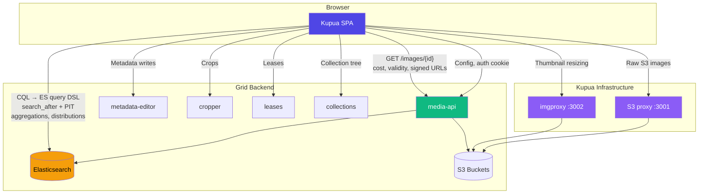
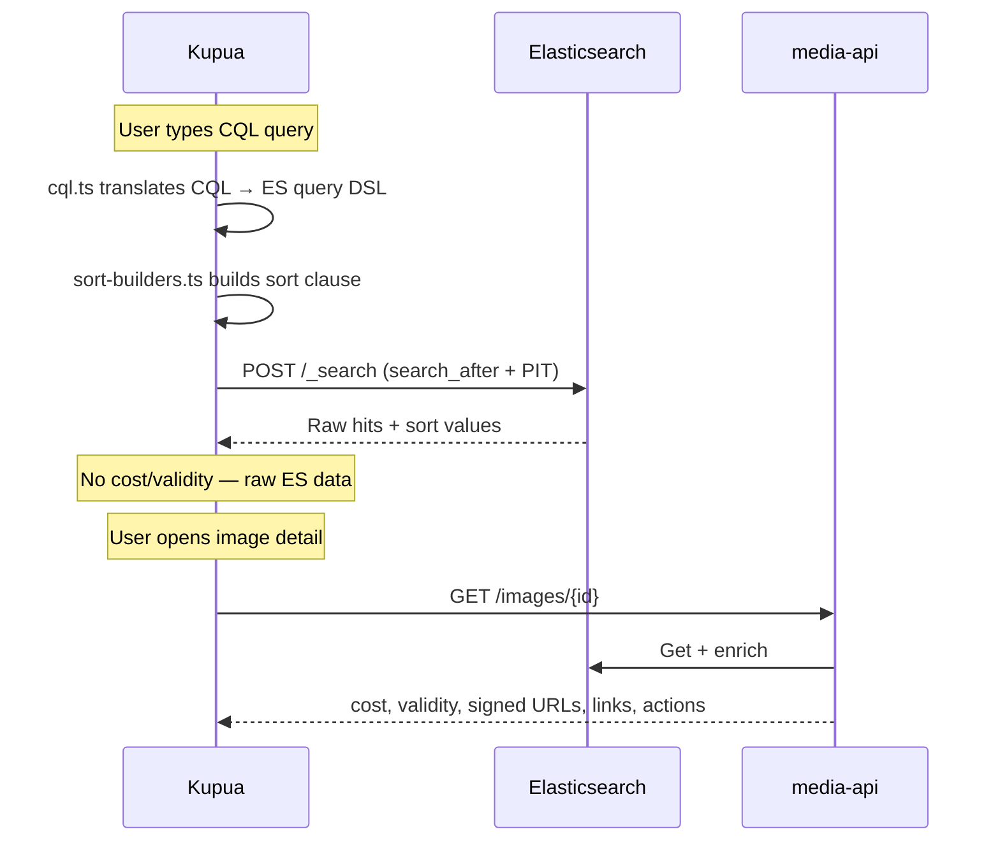

# Kupua–Grid Direct-ES Integration Plan

*For engineer review — produced April 2026*

> **Alternative to:** `integration-plan-api-first.md` (API-first plan, ~8 additive media-api endpoints).
>
> **Core thesis:** Keep direct Elasticsearch as kupua's performance advantage,
> layer media-api incrementally for auth, config, computed fields, and writes.
> Zero media-api changes required. Ships faster with no external dependencies,
> at the cost of portability and some duplicated logic.

Kupua is a fast React frontend for Grid that currently talks directly to Elasticsearch. To replace Kahuna, it needs auth, computed fields (cost/validity/persistence), signed image URLs, config, and write operations — all of which live in Grid's Play/Scala microservices. The plan: keep direct-ES search as the core advantage, layer in media-api incrementally for everything else, lowest-risk phases first.

### Architecture

### Data Flow — Search

### Phase Timeline

```mermaid
gantt
    title Direct-ES Plan — No media-api Changes
    dateFormat  X
    axisFormat %s

    section Auth & Config
    Phase 0 — Auth + discovery      :p0, 0, 1
    Phase 1 — Config                :p1, after p0, 3

    section Read (Hybrid ES + API)
    Phase 2 — Image detail (API)    :p2, after p1, 5
    Phase 3 — is: filters + cost (TS) :p3, after p2, 3
    Phase 4 — Read operations       :p4, after p3, 10

    section Write
    Phase 5 — Write operations      :p5, after p4, 20
    Phase 6 — Upload + delete       :p6, after p5, 10
```

---

## Phase 0 — Dev-nginx + Auth + Service Discovery (half a day)

**What:** Add Kupua as a dev-nginx mapping so it lives on the same cookie domain as all Grid services. Fetch the media-api root endpoint to get authenticated service discovery.

**Why first:** Zero risk. Doesn't change any existing behaviour. Unblocks every subsequent phase.

**Details:**
- Add one entry to `dev/nginx-mappings.yml`: `prefix: kupua.media, port: 3000`
- This gives kupua `kupua.media.local.dev-gutools.co.uk` with HTTPS
- The `gutoolsAuth-assym` cookie is set on `.dev-gutools.co.uk` — covers all Grid subdomains including kupua. Browser sends it automatically.
- **No Vite proxy needed for auth.** media-api is already at `api.media.local.dev-gutools.co.uk` — kupua can call it cross-origin since they share the cookie domain. Only question is whether media-api sets CORS headers (if not, one nginx rule or a Vite proxy fallback).
- Fetch `GET /` on media-api (the HATEOAS root). This returns links to **every Grid service**: collections URI, cropper URI, metadata-editor URI, leases URI, usage URI, loader URI (permission-gated), session URI. Kupua never needs to hardcode service URLs.
- **This is the one file outside `kupua/`** that needs editing — `dev/nginx-mappings.yml`. Low-ceremony: dev-only local config.

**Deliverables:** Kupua shows "logged in as X", has the full service discovery map, confirms cookie works cross-subdomain. Validates whether CORS needs attention.

**Independently useful?** Yes — auth and service discovery unlock everything else.

---

## Phase 1 — Config from media-api (2–3 days)

**What:** Fetch config on startup. Populate: free suppliers list, usage rights categories, cost filter labels, field aliases, staff photographer org, image types, domain metadata specs, announcements, feature flags.

**Why:** Config drives correctness. Without it, Kupua hardcodes Guardian-specific assumptions. This makes Kupua BBC-compatible without code changes.

**Details:**
- Fetch once at startup, expose via store
- Wire config-driven field aliases into field-registry (currently hardcoded)
- Wire `freeSuppliers` + `applicableUsageRights` into filter UI
- **No media-api changes needed**

---

## Phase 2 — Single-Image Detail via media-api (3–5 days)

**What:** When a user opens image detail, fetch `GET /images/{id}` from media-api. This gives:
- **`cost`** (Free/Conditional/Pay/Overquota) — computed from usage rights + config + quotas
- **`valid`** + **`invalidReasons`** — missing credit, no rights, paid image, deny lease, TASS warning, etc.
- **`persisted`** + reasons — 12 persistence rules (has exports, has usages, is archived, in collection, has labels, added to photoshoot, has user edits, etc.)
- **Signed S3 URLs** for source, thumbnail, optimisedPng
- **HATEOAS links** to crops, edits, usages, leases, download
- **Actions** (delete, reindex, add-lease, etc.) — permission-gated

**Search results stay ES-only** — no per-result media-api call. Cost/validity badges in search results come later (Phase 3 or TypeScript replication).

**Independently useful?** Yes — users can assess whether an image is usable.

---

## Phase 3 — `is:` Filters and Cost in Search Results (2–3 days)

**What:** Support `is:GNM-owned`, `is:under-quota`, `is:agency-pick`, `is:deleted`, `is:reapable` in CQL. Also: org-owned count ticker, agency picks ticker. Optionally: replicate `CostCalculator` (~50 lines) in TypeScript for search-result cost badges.

**Details:**
- Extend CQL translator to handle `is:` predicates using same ES queries as media-api
- `is:GNM-owned` → filter on `usageRights.category` in `whollyOwned` categories
- `is:agency-pick` → config-driven query from `agencyPicks.ingredients`
- Cost calculator in TS: check `restrictions` → Conditional; check `defaultCost` per category; check supplier against `freeSuppliers`; check collection exclusions
- **No media-api changes** — replicating stable query logic client-side

**Trade-off:** Duplicates logic from Scala. But these are stable, well-understood transforms. The alternative (proxying all search through media-api) defeats Kupua's entire advantage.

---

## Phase 4 — Full Read Operations (1–2 weeks)

**What:** Usages, leases, file metadata, labels, photoshoots, collection membership, and collection tree browser in detail view.

**Details:**
- **Usages, leases, file metadata** — embedded in the Phase 2 `/images/{id}` response or available via linked HATEOAS endpoints
- **Labels** — freetext tags, read from `userMetadata.labels` in ES. Display on images and support `label:` search filter. Trivial.
- **Photoshoots** — read from `userMetadata.photoshoot` in ES. Display in detail view, support `photoshoot:` search filter.
- **Collection membership** — which collections an image belongs to, read from ES `collections[]` field (path + pathId). Display as chips/tags on images.
- **Collection tree browser** — the full folder hierarchy. Requires calling the **collections service** (`GET /collections`) — a separate Grid microservice backed by DynamoDB, not ES. Needs a Vite proxy route to the collections service (same pattern as `/api` to media-api). Kahuna renders this as a left-panel tree with expand/collapse state stored in localStorage.
- **No media-api changes**

**Note:** Labels and collection membership are available from ES today (pre-integration). The collection tree is the only item here requiring a new service connection.

---

## Phase 5 — Write Operations (2–4 weeks)

**What:** Metadata editing, rights assignment, archiving, labelling, photoshoots, collection management, lease management.

**Details:**
- Metadata edits → `PUT` to metadata-editor
- Usage rights → `PUT` to metadata-editor
- Labels → `POST/DELETE` to metadata-editor
- Crops → `POST` to cropper
- Leases → `POST/DELETE` to leases service
- Permission gating via HATEOAS `actions` from Phase 2 response

**Thrall latency:** After a write, ES won't reflect the change for 1–10 seconds. Options: optimistic local update, poll, or tap into Thrall's notification stream.

**What's hard:** Crop UI (coordinate picker), rights editor (category-dependent form), Thrall latency UX.

---

## Phase 6 — Upload + Deletion (1–2 weeks)

**What:** Upload via image-loader, delete via media-api. Both permission-gated.

---

## What Stays Kupua-Only (No Grid Backend)

These are Kupua's differentiators:
- `search_after` + PIT cursor pagination
- Windowed buffer with eviction
- Two-tier virtualisation (real scrolling through 65k)
- Scrubber with seek/scroll modes
- Table view, grid view, density continuum
- Multi-sort, column customisation
- Position maps
- **imgproxy** for image resizing/thumbnailing — vastly better than Grid's ancient nginx `image_filter` module. Currently runs as a local Docker container; production would need its own EC2 infra (later concern)

## What Uses Vanilla media-api (No Changes)

- Auth (cookie already works via dev-nginx)
- Config endpoint
- Single-image fetch with all computed fields
- All write operations
- All read operations (usages, leases, file metadata)

## What Might Need media-api Changes

**Probably nothing for Phases 0–6.** If Kupua wants server-computed cost/validity for search results at scale (hundreds of images), a lightweight batch endpoint might help — but TypeScript replication is the preferred first approach.

---

## Things We Might Be Wrong About

**These need early validation — any one could change the plan:**

1. **Thumbnail URLs in production.** Kupua uses raw ES `thumbnail.file` URLs via S3 proxy + imgproxy (dev hack). In production, thumbnails are currently served via CloudFront with signed URLs from media-api — but CloudFront image serving is being removed ([grid#4698](https://github.com/guardian/grid/pull/4698)). This may simplify things: if thumbnails move to direct S3 access, Kupua's imgproxy approach could work in production with its own EC2 infra. **Validate the post-CloudFront thumbnail story in Phase 0.**

2. **CORS between Grid subdomains.** Cookie sharing works (same `.dev-gutools.co.uk` domain). But browsers enforce CORS for cross-origin XHR/fetch even on same-parent-domain. media-api may not send `Access-Control-Allow-Origin` / `Access-Control-Allow-Credentials` headers for kupua's origin. **Fix options:** (a) one nginx rule in dev-nginx adding CORS headers, (b) Vite proxy as fallback (rewrites to localhost, avoids CORS entirely), (c) media-api code change (heavier, but correct for production). **Test in Phase 0.**

3. **Quota system.** Quotas live in S3, loaded by media-api. Kupua can't access them directly. If cost badges need quotas for search results, either accept "quota unaware" cost in search results (only detail view shows quota status) or find a way to expose quota data.

4. **Thrall notification stream.** Kahuna may use a WebSocket/SSE for live updates after writes. If no standalone endpoint exists, Kupua polls — worse UX for edits.

5. **Production deployment.** Where does Kupua run? Static SPA on S3+CloudFront? Behind Grid's nginx? A new Play service? This affects auth, CORS, and whether Kupua can still reach ES directly (no SSH tunnel in prod). **This is the biggest unresolved question.**

6. **BBC config.** Several features are BBC-specific: custom validity descriptions, warning text headers, image preview flags, programmes usage rights categories. Guardian-only deployment can ignore these initially, but Phase 1 config ingestion should handle them gracefully.

7. **Collection tree in production.** The collections service URL comes from media-api's HATEOAS root — no hardcoding needed. But in production, kupua would need to reach `media-collections.gutools.co.uk` (or equivalent). Same CORS/proxy question as media-api applies to every Grid service kupua talks to.

---

## Summary

| Phase | Effort | Risk | media-api changes | Independently useful |
|-------|--------|------|-------------------|---------------------|
| 0: Dev-nginx + auth + discovery | ½d | Very low | None | Yes |
| 1: Config | 2–3d | Low | None | Yes |
| 2: Image detail | 3–5d | Low | None | Yes |
| 3: `is:` filters + cost | 2–3d | Low | None | Yes |
| 4: Read operations | 1–2w | Low | None | Yes |
| 5: Write operations | 2–4w | Medium | None (probably) | Yes |
| 6: Upload + delete | 1–2w | Medium | None | Yes |

**Total: ~8–12 weeks for full read-write parity.** Every phase is independently useful. No phase requires deploying anything to real infrastructure. All development happens on localhost with existing Grid dev setup.
