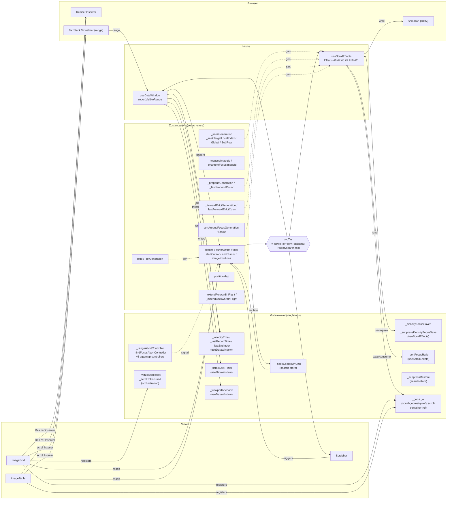

# Scroll System Audit

> Read-only audit of the kupua scrolling stack. Single deliverable: this
> document, filled in. **No code changes. No PRs. No proposals to fix
> things during the audit.** The point is to make the system legible so
> the human can decide what (if anything) to fix afterwards.

## Scope

The "scroll system" is everything that participates in keeping the right
images on screen at the right scroll position across modes, transitions,
and edge cases. Concretely:

- `src/hooks/useDataWindow.ts`
- `src/hooks/useScrollEffects.ts`
- `src/hooks/useScrubber.ts` (and friends in `src/components/scrubber/`)
- `src/stores/search-store.ts` — the parts that govern buffer, offset,
  generations, cooldowns, abort, eviction, extend/seek
- `src/lib/two-tier.ts`
- `src/components/grid/`, `src/components/table/` — scroll-handling parts
- `src/constants/tuning.ts` — the knob inventory
- `src/lib/es-adapter.ts` — only where it interacts with abort/PIT
  generation

**Out of scope:** image detail overlay scroll, fullscreen swipe handling,
the actual ES query construction, the position-map fetch internals
(beyond "it exists, it has its own PIT, it's used by indexed mode").

## Mandate

You are auditing an architecture the human already trusts in broad
strokes. **Do not propose architectural changes.** The three-tier model
(scroll ≤1k / indexed 1k–65k / seek >65k) is fixed by hard constraints
documented in `00 Architecture and philosophy/03-scroll-architecture.md`.
Read that document first; do not re-derive it.

Your job is to find: drift between docs and code, accreted dead
branches, undocumented coupling, and tuning cliffs. Not to redesign.

## Pre-reads (in order)

1. `kupua/AGENTS.md` (orientation)
2. `kupua/exploration/docs/00 Architecture and philosophy/03-scroll-architecture.md` (the model)
3. `kupua/exploration/docs/00 Architecture and philosophy/02-focus-and-position-preservation.md`
4. `kupua/exploration/docs/00 Architecture and philosophy/tuning-knobs.md`
5. `kupua/exploration/docs/changelog.md` — at least the last ~10 entries; many
   record reverted experiments whose vestigial guards may still be in code

## Constraints

- **Read-only.** Do not modify any source file outside this handoff
  document. You may add findings to this file (under "Findings" below).
- **No tests run unless asked.** Vitest is fine if you want to verify a
  hypothesis cheaply; do not run Playwright. If you find yourself
  wanting to run the perf suite, stop and ask the human.
- **No subagents recursing into more audits.** You may use the Explore
  subagent for read-only spelunking. Do not use a subagent to write code.
- **No "while I'm here, I noticed…" cleanup commits.** Findings go in
  this doc only.
- **Time-box yourself.** If a single question is taking more than ~90
  minutes of focused work, stop and write down what you found, what you
  didn't, and why.

## The 5 questions (the deliverable)

Each question gets one section below. Fill them in. Be concise — a single
mermaid diagram, table, or 5-bullet list per section is the target.
Prose should be only what's needed to make the artefact readable.

### Q1. Coupling map — what state lives where, and who reads/writes it?

**Goal:** a single picture (mermaid `graph` is fine) showing every piece
of cross-cutting state in the scroll system, where it's defined, and who
mutates vs reads it. Specifically include:

- Module-level state in `useDataWindow.ts` (e.g. `_lastReportTime`,
  `_velocityEma`, debounce timers)
- Module-level state in `search-store.ts` (cooldown timestamps,
  generation counters, seek-in-flight flags)
- Refs passed via `useScrollEffects.ts`
- The `twoTier` flag and where it's recomputed
- Browser-side state we depend on: `scrollTop`, virtualizer's internal
  range, ResizeObserver triggers
- Generation counters: list each one, what increments it, what compares
  against it

**Output:** one mermaid diagram + a small table mapping each piece of
state to its mutators and consumers.

**Stop when:** you can hand someone the diagram and they can answer
"if I change this value, what else cares?" without reading source.

### Q2. Invariant ledger — what MUST stay true, and what enforces it?

**Goal:** a table of invariants and their guards. Format:

| Invariant | Where it can break | Test that catches it | Notes |
|---|---|---|---|

Seed list (extend or contradict from the code):

- "Swimming = 0 visible content shifts during prepend in seek mode."
- "Buffer never contains stale data after `abortExtends()`."
- "No two seeks in flight against the same PIT generation."
- "After mode flip (e.g. total grows past 1k), no extends fire against
  the wrong virtualizer count."
- "`scrollTop` after seek lands within ±1 row of the requested global
  offset on the first paint."
- "Density switch preserves focused image to within ±viewportHeight."
- "Sort-around-focus preserves focused image."
- "Backward extends never visibly shift content in seek mode."

For each: find the guarding code AND the asserting test. If either is
missing, that's the finding.

**Stop when:** every invariant has either a (code, test) pair, or is
flagged "no test" / "no code guard".

### Q3. Mode-transition matrix — every flip between scroll/indexed/seek

**Goal:** a matrix listing every transition the system can undergo and
what's expected to happen / what's tested.

Rows: from-state (scroll | indexed | seek | initial-load)
Columns: to-state (scroll | indexed | seek)

Plus the *triggers*:
- `total` grows past `SCROLL_MODE_THRESHOLD` (1k)
- `total` grows past `POSITION_MAP_THRESHOLD` (65k)
- `total` shrinks past either
- `search()` reissued (URL change, sort change, filter change)
- Position map finishes loading mid-session
- Position map fetch fails

For each cell that's reachable: which test exercises it? What state
needs to be torn down (PIT, position map, buffer, virtualizer, scroll
position, in-flight extends/seeks)?

**Stop when:** every reachable cell is marked tested / not-tested /
not-reachable, with one-sentence reasoning.

### Q4. Dead-branch list — what code earns its complexity, and what doesn't?

**Goal:** a list of suspected dead/vestigial code paths. The changelog
documents many reverted experiments (`_postSeekBackwardSuppress`, the
700→1500ms cooldown bumps, `requestAnimationFrame` swap, `overflow-anchor:
none`). Each reversion may have left guards that no longer earn their
keep.

Output format per suspect:

| Code path | Where (file:line) | Comment claims | Recent commit history | Tests that touch it | Confidence dead |
|---|---|---|---|---|---|

"Confidence dead" = low / medium / high based on: is there an asserting
test? Does removing it (mentally) violate any invariant from Q2? Is
the protection it offers also offered elsewhere?

**Do not remove anything.** Just list candidates.

**Stop when:** you've examined every cooldown, every flag, every
generation counter, and every "// don't remove this" comment.

### Q5. Tuning-cliff list — what's one constant change away from regressing?

**Goal:** a table of tuning knobs (from `tuning.ts` and elsewhere) with
their *failure modes*, not just their effects.

| Knob | Current | What goes wrong if too low | What goes wrong if too high | Safe range |
|---|---|---|---|---|

Cover at minimum:
- `BUFFER_CAPACITY`, `PAGE_SIZE`, `EXTEND_THRESHOLD`
- `VELOCITY_EMA_ALPHA`, `VELOCITY_LOOKAHEAD_MS`, `VELOCITY_IDLE_RESET_MS`
- `SEEK_COOLDOWN_MS`, `SEEK_DEFERRED_SCROLL_MS`,
  `POST_EXTEND_COOLDOWN_MS`, `SEARCH_FETCH_COOLDOWN_MS`
- `SCROLL_MODE_THRESHOLD`, `POSITION_MAP_THRESHOLD`, `DEEP_SEEK_THRESHOLD`
- Anything else load-bearing you find that isn't in `tuning.ts`

"Safe range" can be "unknown — depends on ES latency" if that's the
honest answer. Cite tests where they exist.

**Stop when:** every knob has both failure-mode columns filled, or
explicitly marked "no failure mode known on either side".

## What this audit is NOT

- Not a refactoring proposal. If you find consolidation opportunities,
  add them to the "Side observations" section at the bottom but **do
  not pursue them in this session.**
- Not a perf investigation. P8 is what it is — physics-bound on ES
  round-trip. Don't relitigate it.
- Not an opportunity to redesign the three-tier model.
- Not the place to fight with TanStack Virtual's internals.

## Termination conditions (any one ends the session)

- All 5 questions answered with their target artefact.
- Any one question reveals a live correctness bug → **stop immediately,
  add a section "Live bug found" at the top of this doc, hand back to
  the human.**
- ~6 hours of focused work elapsed; write down what you have, mark
  unfinished sections explicitly, hand back.
- You find yourself wanting to write code → stop, ask the human.

## Findings

(empty — fill in below as you go; one section per question)

### Q1. Coupling map

#### State inventory

Buckets:
- **MOD** — module-level `let` (singleton, survives unmount, not in React tree)
- **Z** — Zustand store field (in `search-store.ts` state, triggers re-renders when read via selector)
- **REF** — `useRef`/`MutableRefObject` (component-scoped, survives re-render but not unmount)

| State | Bucket | Defined at | Mutated by | Read by |
|---|---|---|---|---|
| `_lastReportTime`, `_lastEndIndex`, `_velocityEma` | MOD | [useDataWindow.ts:71-74](kupua/src/hooks/useDataWindow.ts#L71) | `reportVisibleRange` (calls pure `_updateForwardVelocity`) | `reportVisibleRange` (via `forwardExtendThreshold(velocityEma)`) |
| `_scrollSeekTimer` | MOD | [useDataWindow.ts:127](kupua/src/hooks/useDataWindow.ts#L127) | `reportVisibleRange` (set/clear), `cancelScrollSeek` | same |
| `_viewportAnchorId` | MOD | [useDataWindow.ts:146](kupua/src/hooks/useDataWindow.ts#L146) | `reportVisibleRange` (sets to nearest-centre id), `resetViewportAnchor` | `getViewportAnchorId()` → orchestration/search, useUrlSearchSync; window-exposed for E2E |
| `_densityFocusSaved` | MOD | [useScrollEffects.ts:72](kupua/src/hooks/useScrollEffects.ts#L72) | Effect #10 unmount (`saveDensityFocusRatio`), `clearDensityFocusRatio` | Effect #11 mount (`peekDensityFocusRatio`) |
| `_suppressDensityFocusSave` | MOD | [useScrollEffects.ts:81](kupua/src/hooks/useScrollEffects.ts#L81) | `suppressDensityFocusSave()` (called from `resetToHome`); auto-cleared on next mount read | `saveDensityFocusRatio` (gates the save) |
| `_sortFocusRatio` | MOD | [useScrollEffects.ts:120](kupua/src/hooks/useScrollEffects.ts#L120) | `saveSortFocusRatio()` (sync, before async search) | Effect #9 (`consumeSortFocusRatio`, single-shot) |
| `_seekCooldownUntil` | MOD | [search-store.ts:472](kupua/src/stores/search-store.ts#L472) | `seek()` (5 sites: shallow, deep, sort-focus reposition, search-fetch overload, post-extend), `abortExtends()` | `extendForward`, `extendBackward` (block guards) |
| `_suppressRestore` | MOD | [search-store.ts:486](kupua/src/stores/search-store.ts#L486) | `suppressNextRestore()` (resetToHome), `clearSuppressRestore()` | `restoreAroundCursor` (consumes) |
| `_rangeAbortController` | MOD | [search-store.ts:449](kupua/src/stores/search-store.ts#L449) | `search()`, `seek()`, `extendForward/Backward` (rotate on each fetch) | All extend/seek fetches (signal) |
| `_findFocusAbortController` | MOD | [search-store.ts:463](kupua/src/stores/search-store.ts#L463) | `search()` only (NOT seek — see in-source comment) | `_findAndFocusImage` Steps 1-2 |
| `_positionMapAbortController`, `_aggAbortController`, `_sortDistAbortController`, `_nullZoneDistAbortController`, `_expandedAggAbortController` | MOD | [search-store.ts:495-513](kupua/src/stores/search-store.ts#L495) | `search()` aborts; respective fetchers rotate | Their fetchers (signal) |
| `_newImagesPollTimer`, `_newImagesPollGeneration` | MOD | [search-store.ts:434,443](kupua/src/stores/search-store.ts#L434) | `startNewImagesPoll`, `search()` (++gen invalidates) | poll callback (stale check) |
| `_el` (scroll container) | MOD | [lib/scroll-container-ref.ts:20](kupua/src/lib/scroll-container-ref.ts#L20) | `setScrollContainer` from ImageGrid/ImageTable mount | useScrollEffects, scrubber, useDataWindow effects |
| `_geo` (rowHeight, columns) | MOD | [lib/scroll-geometry-ref.ts:20](kupua/src/lib/scroll-geometry-ref.ts#L20) | `setScrollGeometry` from ImageGrid/ImageTable | useScrollEffects (compensation math), Scrubber |
| `_virtualizerReset`, `_scrollToFocused`, `_thumbResetGeneration`, `_cqlInputGeneration`, `_isUserInitiatedNavigation` | MOD | [lib/orchestration/search.ts:30-247](kupua/src/lib/orchestration/search.ts#L30) | `registerVirtualizerReset`, `search()` orchestration | Out-of-scroll-scope but couples into search→scroll handoff |
| `pitId` | Z | [search-store.ts:209](kupua/src/stores/search-store.ts#L209) | `search()` (open), `closePit` | es-adapter requests |
| `_pitGeneration` | Z | [search-store.ts:213](kupua/src/stores/search-store.ts#L213) | `search()` (++) | `extendForward/Backward`, `seek` (mid-flight stale check) |
| `bufferOffset`, `results`, `total`, `startCursor`, `endCursor`, `imagePositions` | Z | [search-store.ts:191-208](kupua/src/stores/search-store.ts#L191) | `seek`, `extendForward/Backward`, `search` | useDataWindow, useScrollEffects, ImageGrid/Table, Scrubber |
| `focusedImageId`, `_phantomFocusImageId` | Z | [search-store.ts:217-221](kupua/src/stores/search-store.ts#L217) | `setFocusedImageId`, `_findAndFocusImage` | useScrollEffects #9, useListNavigation, ImageGrid/Table |
| `sortAroundFocusGeneration`, `sortAroundFocusStatus` | Z | [search-store.ts:229,225](kupua/src/stores/search-store.ts#L225) | `_findAndFocusImage` completion | useScrollEffects Effect #9, status UI |
| `_lastPrependCount`, `_prependGeneration` | Z | [search-store.ts:245-247](kupua/src/stores/search-store.ts#L245) | `extendBackward` | useScrollEffects Effect #7 (scrollTop compensation) |
| `_lastForwardEvictCount`, `_forwardEvictGeneration` | Z | [search-store.ts:255-257](kupua/src/stores/search-store.ts#L255) | `extendForward` (when evicting) | useScrollEffects Effect #8 (scrollTop compensation) |
| `_seekGeneration`, `_seekTargetLocalIndex`, `_seekTargetGlobalIndex`, `_seekSubRowOffset` | Z | [search-store.ts:260-275](kupua/src/stores/search-store.ts#L260) | `seek()`, sort-around-focus reposition | useScrollEffects Effect #6 |
| `positionMap` | Z | search-store.ts | `_loadPositionMap` (background after `search()`); cleared by `search()`; preserved by `seek()` | `useDataWindow` (twoTier seek lookup), routes/search.tsx |
| `_extendForwardInFlight`, `_extendBackwardInFlight` | Z | [search-store.ts:240-241](kupua/src/stores/search-store.ts#L240) | extend wrappers | extend re-entry guard |
| `virtualizerRef`, `scrollContainerRef` | REF | created in ImageGrid/ImageTable | TanStack Virtual mount | useScrollEffects (passed via props) |
| `geometry` ({rowHeight, columns, headerOffset}) | prop | computed in ImageGrid/ImageTable | re-derived per render | useScrollEffects (compensation math) |
| `twoTier` | derived | [routes/search.tsx:~72](kupua/src/routes/search.tsx) via `isTwoTierFromTotal(total)` from [lib/two-tier.ts:10](kupua/src/lib/two-tier.ts#L10) | re-derived per render from `total` | useDataWindow (virtualizerCount, index space), useScrollEffects (#6, #9 coordinate space), ImageGrid/Table |
| `scrollTop` (DOM) | browser | scroll container element | useScrollEffects Effects #6/#7/#8/#9, virtualizer.scrollToIndex | ImageGrid (ResizeObserver anchor), ImageTable (proxy sync), useDataWindow (reportVisibleRange computes from virtualizer range) |
| `ResizeObserver` | browser | [ImageGrid.tsx:256](kupua/src/components/ImageGrid.tsx#L256), [ImageTable.tsx:416,1045](kupua/src/components/ImageTable.tsx#L416) | width changes | column-count recompute (grid), header-height + proxy scrollbar (table) |
| Native `scroll` listeners | browser | TanStack virtualizer (auto), [ImageTable.tsx:1020-1021](kupua/src/components/ImageTable.tsx#L1020) (header proxy sync) | user scroll, programmatic scrollTop | virtualizer range → reportVisibleRange |

#### Generation counters — increment vs comparison sites

| Counter | Bucket | Increment | Compare |
|---|---|---|---|
| `_pitGeneration` | Z | `search()` (PIT open) | `extendForward`, `extendBackward`, `seek()` mid-flight (skip stale PIT close) |
| `_seekGeneration` | Z | `seek()`, sort-around-focus reposition | useScrollEffects Effect #6 |
| `_prependGeneration` | Z | `extendBackward` | useScrollEffects Effect #7 |
| `_forwardEvictGeneration` | Z | `extendForward` (only when evicting) | useScrollEffects Effect #8 |
| `sortAroundFocusGeneration` | Z | `_findAndFocusImage` completion | useScrollEffects Effect #9 |
| `_newImagesPollGeneration` | MOD | `startNewImagesPoll`, `search()` | poll callback (stale skip) |
| `_thumbResetGeneration` | MOD (orchestration) | `search()` orchestration | scrubber thumb reset |
| `_cqlInputGeneration` | MOD (orchestration) | CQL input | search dedupe |

All counters have at least one increment + one compare site. None observed orphaned in either direction.

#### Coupling diagram



#### Notes

- **Cooldown is one-bit asymmetric.** `_seekCooldownUntil` is the single rate-limit timestamp; there's no separate post-extend cooldown variable — `extendForward` reuses it ([search-store.ts:2124](kupua/src/stores/search-store.ts#L2124)) by setting it to `Date.now() + POST_EXTEND_COOLDOWN_MS` after a successful extend. So one timestamp guards three distinct hazards (seek-in-flight, search-fetch overload, post-extend cascade) at three different durations.
- **`twoTier` has exactly one definition site.** `isTwoTierFromTotal(total)` in [lib/two-tier.ts](kupua/src/lib/two-tier.ts). Read in `routes/search.tsx`, then plumbed as a prop. No drift risk.
- **Velocity state is module-singleton, not per-component.** Switching density (table↔grid) does not reset it. `VELOCITY_IDLE_RESET_MS` (250ms) handles staleness via the `dt > IDLE_RESET` guard; the explicit `_resetForwardVelocity()` is test-only.
- **`_findFocusAbortController` is deliberately split from `_rangeAbortController`** — see in-source comment at [search-store.ts:455](kupua/src/stores/search-store.ts#L455). seek() must not abort the focus-finding work.
- **`_viewportAnchorId` is read by orchestration/search and useUrlSearchSync** — phantom focus depends on it surviving across density swaps, hence module-level not ref.

### Q2. Invariant ledger

| # | Invariant | Code guard | Asserting test | Status |
|---|---|---|---|---|
| 1 | Swimming = 0 visible content shifts during prepend in seek mode | Bidirectional seek (deep path fetches `halfBuffer ≈ 100` backward items so user lands mid-buffer with off-screen headroom): [search-store.ts](kupua/src/stores/search-store.ts) `seek()` deep branch (~L2200–2280); prepend compensation in [useScrollEffects.ts:377](kupua/src/hooks/useScrollEffects.ts#L377) (`_prependGeneration` effect) | [scrubber.spec.ts:669](kupua/e2e/local/scrubber.spec.ts#L669) `no visible content shift during settle window after seek` (`MAX_SHIFT = 0`); [scrubber.spec.ts:855](kupua/e2e/local/scrubber.spec.ts#L855) headroom-zone swimming check | ✅ guarded + tested |
| 2 | Buffer never contains stale data after `abortExtends()` | [search-store.ts:1979](kupua/src/stores/search-store.ts#L1979) `abortExtends()` rotates `_rangeAbortController` + sets `_seekCooldownUntil = now + SEARCH_FETCH_COOLDOWN_MS` (2s); extend wrappers honour both. PIT-generation stale check at [L1883/L2025](kupua/src/stores/search-store.ts#L1883). Five-layer defence enumerated in [buffer-corruption.spec.ts:6-22](kupua/e2e/local/buffer-corruption.spec.ts#L6) | [buffer-corruption.spec.ts](kupua/e2e/local/buffer-corruption.spec.ts) (entire file is this invariant: stale-prepend after search, after density swap, after CQL change); [search-store.test.ts:1100](kupua/src/stores/search-store.test.ts#L1100) `describe("stale buffer prevention")` | ✅ guarded + tested (heavily) |
| 3 | No two seeks in flight against the same PIT generation | `effectivePitId = get()._pitGeneration === capturedGen ? pitId : null` at [search-store.ts:1883](kupua/src/stores/search-store.ts#L1883) (extendForward), [L2025](kupua/src/stores/search-store.ts#L2025) (extendBackward), [L2157](kupua/src/stores/search-store.ts#L2157) (seek). Each `search()` rotates `_rangeAbortController` so a prior seek's fetch aborts | [search-store.test.ts:740](kupua/src/stores/search-store.test.ts#L740) "Fire two seeks — the first should be aborted" → `assertPositionsConsistent("after concurrent seeks")` | ✅ guarded + tested |
| 4 | After mode flip, no extends fire against the wrong virtualizer count | `twoTier = isTwoTierFromTotal(total)` is the *only* coordinate-space switch ([lib/two-tier.ts:10](kupua/src/lib/two-tier.ts#L10)). It's recomputed from `total` synchronously per render, not from `positionMap !== null` (would cause late flip — see `03-scroll-architecture.md` §3). `useDataWindow` reads `twoTier` to set `virtualizerCount = twoTier ? total : results.length` and to choose local-vs-global indices | [search-store-position-map.test.ts](kupua/src/stores/search-store-position-map.test.ts) — transition tests across `SCROLL_MODE_THRESHOLD`. Tier matrix [tier-matrix.spec.ts](kupua/e2e/local/tier-matrix.spec.ts) exercises buffer/two-tier/seek but only at static totals — **no test exercises a live `total` crossing 1k or 65k mid-session** | ⚠️ guarded; the *transition* (not just static tiers) lacks an explicit test |
| 5 | scrollTop after seek lands within ±1 row of the requested global offset on first paint | [useScrollEffects.ts:375](kupua/src/hooks/useScrollEffects.ts#L375) Effect #6 (`_seekGeneration`): reverse-computes target pixel from `_seekTargetLocalIndex` + `_seekSubRowOffset`; gates `if (Math.abs(scrollTop - target) > geo.rowHeight) {…}` to suppress sub-row jitter. `computeScrollTarget` is pure | [reverse-compute.test.ts](kupua/src/stores/reverse-compute.test.ts) — `computeScrollTarget` unit tests; [scrubber.spec.ts](kupua/e2e/local/scrubber.spec.ts) settle-window asserts overall stability but does not pixel-check the landing precision | ✅ guarded; pixel-precision asserted at unit level only |
| 6 | Density switch preserves focused image to within ±viewportHeight | [useScrollEffects.ts:975](kupua/src/hooks/useScrollEffects.ts#L975) unmount save (`saveDensityFocusRatio` → `_densityFocusSaved`); [L787](kupua/src/hooks/useScrollEffects.ts#L787) mount restore (`peekDensityFocusRatio`, two-rAF wait, edge clamp, `abortExtends()` 2s cooldown to prevent prepend-then-clamp drift). `_suppressDensityFocusSave` flag for `resetToHome` path | [tier-matrix.spec.ts:624](kupua/e2e/local/tier-matrix.spec.ts#L624) "Density switch: PgDown ×3 preserves position"; [L671](kupua/e2e/local/tier-matrix.spec.ts#L671) "seek 50% in table → grid → table round-trip is stable" (clamp `cols × 2` rows). [tier-matrix.spec.ts:331](kupua/e2e/local/tier-matrix.spec.ts#L331) rapid toggling | ✅ guarded + tested |
| 7 | Sort-around-focus preserves focused image | [search-store.ts:~1145](kupua/src/stores/search-store.ts#L1145) `_findAndFocusImage` (find image → countBefore → load buffer around it). [useScrollEffects.ts:657](kupua/src/hooks/useScrollEffects.ts#L657) Effect #9 (`sortAroundFocusGeneration`): scrolls to `findImageIndex(focusedImageId)` honouring `_sortFocusRatio` for viewport-relative position. `_findFocusAbortController` deliberately separated from `_rangeAbortController` so seek doesn't kill it | [scrubber.spec.ts:1211](kupua/e2e/local/scrubber.spec.ts#L1211) "Never Lost" pattern; multiple sort-change tests in scrubber.spec.ts | ✅ guarded + tested |
| 8 | Backward extends never visibly shift content in seek mode | Geometric — bidirectional seek leaves `range.startIndex > EXTEND_THRESHOLD`, so extendBackward only fires when user scrolls back into the headroom (off-screen). Compensation: [useScrollEffects.ts:377](kupua/src/hooks/useScrollEffects.ts#L377) Effect #7 in `useLayoutEffect`. In two-tier mode prepend compensation is gated off entirely (items replace at fixed global indices) | [scrubber.spec.ts:920–1023](kupua/e2e/local/scrubber.spec.ts#L920) detects scrollTop *decrease* during settle (sentinel for swimming during natural backward scroll). [buffer-corruption.spec.ts:540](kupua/e2e/local/buffer-corruption.spec.ts#L540) catches rogue extendBackward firing | ✅ guarded + tested (sentinel rather than direct shift measurement) |

#### Findings

- **One genuine gap (Q4 candidate, not a live bug):** invariant **#4** has no test that drives `total` *across* a tier boundary mid-session — only static-tier coverage. A query whose result count changes (e.g. ticker arrival pushing total from 999 → 1001) would exercise the `twoTier` flip; nothing asserts it doesn't break the in-flight virtualizer or scrollTop. Whether this is reachable in practice depends on whether `total` ever changes outside `search()`/`seek()` — worth checking when looking at Q3 transitions.
- **Invariant #5 is asserted only at unit-test level** (the pure `computeScrollTarget`). The integration assertion is "settle window stable" rather than "scrollTop within ±rowHeight of target". For the audit's purposes that's adequate (the gate inside Effect #6 enforces it), but a dedicated landing-precision check would be cheap.
- All eight invariants have at least one code guard. None are guard-less.

### Q3. Mode-transition matrix

#### Up front

- **`total` only changes via `search()` or `seek()` fallback paths** ([search-store.ts:1747,1772,1417,1204,3340](kupua/src/stores/search-store.ts#L1747)). The new-images poll updates `newCount` (banner) but **not** `total`. So no spontaneous tier flip while idle.
- **`seek()` never changes mode** — it preserves total, PIT, and `positionMap`. Same-mode by construction.
- **Position map load/error/abort is not a mode flip.** `twoTier` is derived from total alone (see [lib/two-tier.ts:10](kupua/src/lib/two-tier.ts#L10) and `03-scroll-architecture.md` §3). The map presence only affects seek *strategy*, not the coordinate space.
- **Density swap, panel resize, window resize, sort change** preserve total → mode unchanged.
- **The transition matrix therefore reduces to: "what does `search()` do when it crosses a tier boundary?"**

#### Matrix

Rows: from-mode (mode of the *previous* result set). Columns: to-mode (mode after `search()` settles). All triggered by `search()` reissue.

|  | → scroll (≤1k) | → indexed (1k–65k) | → seek (>65k) |
|---|---|---|---|
| **initial-load** | unit ✓ [position-map.test.ts:86](kupua/src/stores/search-store-position-map.test.ts#L86), [scrubber.spec.ts:2644](kupua/e2e/local/scrubber.spec.ts#L2644) (narrow date range) | unit ✓ [position-map.test.ts:100,258,271](kupua/src/stores/search-store-position-map.test.ts#L100); E2E ✓ tier-matrix two-tier project | unit ✓ [position-map.test.ts:122,288](kupua/src/stores/search-store-position-map.test.ts#L122); E2E ✓ tier-matrix seek project |
| **scroll** → | E2E ✓ tier-matrix buffer project (static); transitions implicit via [browser-history.spec.ts](kupua/e2e/local/browser-history.spec.ts) | ⚠️ no test exercises a live broaden | ⚠️ no test exercises a live broaden |
| **indexed** → | ⚠️ no test exercises a live narrow | E2E ✓ tier-matrix two-tier project; [position-map.test.ts:158](kupua/src/stores/search-store-position-map.test.ts#L158) "invalidates position map on new search"; [position-map.test.ts:188](kupua/src/stores/search-store-position-map.test.ts#L188) "aborts in-flight fetch" | ⚠️ no test exercises a live broaden |
| **seek** → | ⚠️ no test exercises a live narrow-to-tiny | ⚠️ no test exercises a live narrow into 1k–65k | E2E ✓ tier-matrix seek project (static) |

`✓` = explicitly tested. `⚠️` = reachable via URL/CQL change but no test asserts the post-transition state.

#### Teardown checklist (what `search()` does on every transition)

Same regardless of from/to tier:

| State | Action | Site |
|---|---|---|
| `_rangeAbortController` | `.abort()` then rotate | [search-store.ts](kupua/src/stores/search-store.ts) `search()` head |
| `_findFocusAbortController` | `.abort()` then rotate | same |
| `_positionMapAbortController` | `.abort()` if present | [L1658](kupua/src/stores/search-store.ts#L1658) |
| `_aggAbortController` + 3 sibling agg controllers | `.abort()` | [search()] head |
| `pitId` (old) | closePit (or skip if `_pitGeneration` advanced) | extends/seek bail on stale gen |
| `_pitGeneration` | `++` (after new PIT opens) | [L1685](kupua/src/stores/search-store.ts#L1685) |
| `_seekCooldownUntil` | `now + SEARCH_FETCH_COOLDOWN_MS` (2s) via `abortExtends()` | [L1979](kupua/src/stores/search-store.ts#L1979) |
| `positionMap`, `positionMapLoading` | reset to `null`, `false` | [L1668](kupua/src/stores/search-store.ts#L1668) |
| `results`, `bufferOffset` | replaced with first page; `bufferOffset = 0` (or focus-found offset for sort-around-focus) | [L1747,1772](kupua/src/stores/search-store.ts#L1747) |
| `imagePositions` | rebuilt from new buffer | search() set |
| `total` | new value | [L1747,1772](kupua/src/stores/search-store.ts#L1747) |
| `_seekGeneration` | not bumped by `search()` itself, but Effect #6 still re-runs because `_seekTargetLocalIndex` changes — verify | (potential dead-branch candidate for Q4) |
| `focusedImageId` | preserved (durable); sort-around-focus may relocate it | `02-focus-and-position-preservation.md` §2.3 |
| `_phantomFocusImageId` | set if phantom focus relocation runs | search() conditional |
| Virtualizer count | re-derived from `total` (synchronously) → `twoTier` flips atomically | useDataWindow |
| scrollTop | reset by orchestration's registered `_virtualizerReset` callback (lib/orchestration/search.ts:63) | search() orchestration |
| Scrubber thumb | reset via `_thumbResetGeneration++` | orchestration |

After `seek()` (no transition):
- Same as above **minus** PIT close/reopen, **minus** positionMap reset, **plus** `_seekGeneration++`, `_seekTargetLocalIndex/GlobalIndex/SubRowOffset` set.

#### Findings

- **Coverage hole: 7 of 9 reachable cross-tier-flip cells in E2E have no asserting test.** All same-tier and initial-load cells are covered (unit + E2E), but no test takes a populated indexed/seek session and forces it to flip via a live URL/CQL change. The unit boundary tests only exercise initial-load reactions to different `total` values.
- **The risk is not "tier flip in steady state" (unreachable — `total` only moves via `search()`/`seek()`).** It's "tier flip *while* an extend or position-map fetch is in flight." `abortExtends()` + `_rangeAbortController` rotation + `_pitGeneration` stale guard cover this in code (Q2 #2, #3); the missing tests would be regression sentinels.
- **No tests for position-map fetch failure recovery.** [search-store.ts:995,1003](kupua/src/stores/search-store.ts#L995) silently nulls the map on error/abort. Indexed mode without a map is a real intermediate state — virtualizer still spans `total`, scrubber drag still scrolls, but seek strategy degrades to percentile path. No test asserts the degraded path works.
- **`_seekGeneration` after `search()`:** flagged for Q4 — Effect #6 watches `_seekGeneration`, but `search()` doesn't bump it directly. Whether Effect #6 fires after a fresh search depends on whether `_seekTargetLocalIndex` is set elsewhere on the search path. Worth digging into.

### Q4. Dead-branch list

| # | Code path | Where | Comment claims | History | Tests that touch it | Confidence dead |
|---|---|---|---|---|---|---|
| 1 | Entire file `prepend-transform.ts` (140 lines) | [src/lib/prepend-transform.ts](kupua/src/lib/prepend-transform.ts) (`startPrependTransformSubscriber`, `clearPreCompensationTransform`, `applyPreCompensation`, module-level `_prevPrependGen`, `_prevForwardEvictGen`, `_activeTransformTarget`) | "CSS transform pre-compensation for backward extends. Eliminates intermediate frame." Module preamble describes a flow where `useScrollEffects` calls `clearPreCompensationTransform()` after adjusting scrollTop. | Created for the **A+T (CSS transform) experiment** (changelog 8 April 2026 §"FOCC research"): "translateY(-Δ) on sizer div via Zustand subscribe + will-change: transform. Flash visually worse — TanStack Virtual recalculates row top values, compounding with transform. **Reverted.**" The file was never deleted. | None — not imported anywhere | **HIGH** — `startPrependTransformSubscriber` has zero callers; `clearPreCompensationTransform` is referenced only within the same file's own preamble comment; useScrollEffects does not import it. The subscriber's preamble references a contract (`useLayoutEffect ... removes the transform`) that does not exist in the codebase. Bidirectional seek (Q2 #1) made it unnecessary in any case. |
| 2 | `// Post-seek backward extend suppression — REMOVED (Agent 10)` block | [useDataWindow.ts:130-135](kupua/src/hooks/useDataWindow.ts#L130) and matching `// NOTE: _postSeekBackwardSuppress flag was removed (Agent 10)` at [search-store.ts:3021](kupua/src/stores/search-store.ts#L3021) | Documents the absence of a flag that was removed 5 April 2026 | Tombstone comment from agent 10's removal. | N/A | **HIGH** — pure documentation of a non-existent thing; the changelog already records it. Six lines of comment with negative information value. |
| 3 | `devLog` "NO-OP" branch in Effect #6 | [useScrollEffects.ts:494-500](kupua/src/hooks/useScrollEffects.ts#L494) (the `else if (el)` branch logging "NO-OP" with full scroll target metrics) | Diagnostic for the seek-target gate decisions | Survived from agent 7/10 swimming saga as observability | Indirectly via any test that fires a seek (logs only — never asserted) | **LOW** — `devLog` is DCE'd in prod, so it's free at runtime. But noise in dev/E2E logs. Not a bug. Listed for completeness. |
| 4 | Triple-guard on extends: `_extendForwardInFlight` + `_seekCooldownUntil` + `_pitGeneration` | extendForward [search-store.ts:1849-1883](kupua/src/stores/search-store.ts#L1849); extendBackward [L1992-2025](kupua/src/stores/search-store.ts#L1992) | Three independent stale-detection guards | Accreted over many bugs | All three exercised by [buffer-corruption.spec.ts](kupua/e2e/local/buffer-corruption.spec.ts), [search-store.test.ts](kupua/src/stores/search-store.test.ts) | **NONE — earns its keep.** Inflight prevents re-entry; cooldown prevents post-seek cascade; PIT-gen prevents 404 on closed PIT. Each closes a distinct race window. Listed because triple-guards usually warrant scrutiny — these don't. |
| 5 | `POST_EXTEND_COOLDOWN_MS = 50ms` post-extend cooldown after backward extends | [search-store.ts:2123-2124](kupua/src/stores/search-store.ts#L2123); knob in [tuning.ts:182](kupua/src/constants/tuning.ts#L182) | Spaces out cascading prepends so each scrollTop compensation settles before the next fires | Introduced agent 10 as part of removing `_postSeekBackwardSuppress` | Implicitly by [scrubber.spec.ts:920-1023](kupua/e2e/local/scrubber.spec.ts#L920) (settle-window stability) | **LOW (i.e. probably not dead).** Bidirectional seek made the *first* prepend off-screen, but successive backward extends as the user scrolls back into the headroom can still cascade. The 50ms cooldown is one of the cheapest knobs in the system. Removing it would invite regression but no test would catch the regression directly. |
| 6 | `_seekTargetLocalIndex = -1` "scroll to 0" sentinel | [search-store.ts:265](kupua/src/stores/search-store.ts#L265), Effect #6 ternary at [useScrollEffects.ts:459-462](kupua/src/hooks/useScrollEffects.ts#L459) | "-1 means scroll to 0 (default)" | Originated when `_seekTargetLocalIndex` was added | Multiple seek tests | **NONE — earns its keep.** Sentinel encodes "no explicit target" distinct from "target is index 0". Removing it would require a separate boolean. |

#### Other items examined and found NOT dead

- `_suppressRestore` / `suppressNextRestore` / `clearSuppressRestore` ([search-store.ts:486-492](kupua/src/stores/search-store.ts#L486)) — actively consumed by `restoreAroundCursor` ([L3253-3258](kupua/src/stores/search-store.ts#L3253)), set by `resetToHome` ([reset-to-home.ts:63](kupua/src/lib/reset-to-home.ts#L63)).
- `_focusedImageKnownOffset` — actively used by snap-back navigation ([useScrollEffects.ts:730](kupua/src/hooks/useScrollEffects.ts#L730), [search-store.ts:1600](kupua/src/stores/search-store.ts#L1600)).
- `_pendingFocusDelta` — consumed by Effect #9 ([useScrollEffects.ts:717](kupua/src/hooks/useScrollEffects.ts#L717)) for pageDown post-arrival focus.
- `_pendingFocusAfterSeek` — consumed by Effect #6 ([useScrollEffects.ts:507](kupua/src/hooks/useScrollEffects.ts#L507)) for Home/End-with-focus.
- `_phantomFocusImageId` — alive (multiple tests, Effect #9 reads + clears).
- `_findFocusAbortController` split from `_rangeAbortController` — earns keep, see in-source comment at [search-store.ts:455](kupua/src/stores/search-store.ts#L455).
- `_seekGeneration` not bumped by `search()` — confirmed Q3 finding. **Not dead** — scrollTop reset on search comes from orchestration's `_virtualizerReset` callback, not Effect #6. Two distinct mechanisms for two distinct triggers. Worth a one-line comment in `search()` to make this non-obvious wiring legible.
- `Math.abs(el.scrollTop - targetPixelTop) > geo.rowHeight` gate in Effect #6 — earns keep per its own in-source comment (sub-row jitter would shift visible content).
- All FOCC-experiment artefacts other than `prepend-transform.ts` have been cleaned up: no `flushSync`, no `overflow-anchor` CSS, no `markPrependPreCompensated`/`consumePrependPreCompensated`, no synthetic-seek code. Only the single `flushSync` reference is in a comment ([useScrollEffects.ts:646](kupua/src/hooks/useScrollEffects.ts#L646)) explaining why a different approach was chosen.

#### Recommended actions (for the human, not for this audit)

1. **Delete `prepend-transform.ts`.** Highest-confidence dead code in the system. ~140 lines, zero risk, zero behavioural change.
2. **Delete the two "REMOVED (Agent 10)" tombstone comments.** Trivial.
3. **Consider gating the verbose Effect #6 NO-OP `devLog`** behind a finer-grained dev flag — it fires on every seek and adds noise to perf logs. Optional.

### Q5. Tuning-cliff list

Failure modes — not effects. "Too low" / "too high" answer the question *what visibly breaks?*. "Tested at" cites the test that would catch a regression in that direction (or `none`).

| Knob | Current | Too low → | Too high → | Tested at |
|---|---|---|---|---|
| `BUFFER_CAPACITY` | 1000 | <2 × PAGE_SIZE: every extend replaces the whole buffer; backward extends hit `bufferOffset = 0` constantly, no headroom for swimming-free seek | High memory; eviction-triggered scroll compensation accumulates pixel drift past `maxScroll`; original density-focus drift bug | none direct (changing it without changing PAGE_SIZE/SCROLL_MODE_THRESHOLD breaks `BUFFER_CAPACITY ≥ SCROLL_MODE_THRESHOLD` invariant) |
| `PAGE_SIZE` | 200 | Severe jank +6%, janky frames +50%, DOM churn +5%, LoAF +33% (Experiment D, 200→100); more frequent extends → more compensation events | Bidirectional seek's `halfBuffer` headroom shrinks relative to PAGE_SIZE, bringing prepend back into the viewport (swimming returns); slower per-extend network | [scrubber.spec.ts:669](kupua/e2e/local/scrubber.spec.ts#L669) catches the swimming side; perf audit P8 catches the jank side |
| `EXTEND_THRESHOLD` | 50 | Extends fire later → user sees placeholder gaps during fast scroll; compounds with the seek-mode wall | Extends fire too early → buffer churn even at slow scroll, more network | Velocity-aware widening pushes the effective threshold up, so static value mostly matters at rest. No direct test of the floor. |
| `VELOCITY_EMA_ALPHA` | 0.4 | Threshold lags behind real velocity, doesn't widen in time → seek-mode wall returns | Threshold whipsaws between 50 and PAGE_SIZE on every wheel event → erratic extend timing | [useDataWindow.test.ts](kupua/src/hooks/useDataWindow.test.ts) (10 EMA unit tests, including burst smoothing & negative velocity) |
| `VELOCITY_LOOKAHEAD_MS` | 400 | Threshold doesn't expand enough to cover one ES round-trip → seek-mode wall returns under fast scroll | Threshold caps at PAGE_SIZE early; effectively wasted; extends fire much earlier than needed → buffer churn | useDataWindow.test.ts (linearity + cap tests) |
| `VELOCITY_IDLE_RESET_MS` | 250 | Velocity drops to zero between wheel events of the same gesture → threshold collapses mid-burst | Stale velocity from an earlier burst widens the threshold spuriously after a long pause | useDataWindow.test.ts (idle reset test); no E2E |
| `SEEK_COOLDOWN_MS` | 100 | Extends fire while virtualizer is still settling → buffer corruption (the "swimming after seek" regression of agent 7) | First extends after seek delayed → cells below viewport appear later; user perceives lag | [scrubber.spec.ts:669](kupua/e2e/local/scrubber.spec.ts#L669) catches the swimming side; no upper-bound test |
| `SEEK_DEFERRED_SCROLL_MS` | `SEEK_COOLDOWN_MS + 50` (= 150) | If `< SEEK_COOLDOWN_MS`, the synthetic scroll fires during cooldown and is *swallowed* → no extends ever fire → freeze at buffer bottom (documented in tuning.ts) | Extends fire later after seek → cells below viewport visibly empty for longer | none direct; the derivation `+ 50` (margin ≥ 15) is the safety guard, not a test |
| `POST_EXTEND_COOLDOWN_MS` | 50 | Cascading prepend compensations don't have time to paint → swimming returns when scrolling backward through a deep buffer | Extends throttle so much that backward scroll feels stuttery (placeholder gaps) | [scrubber.spec.ts:920–1023](kupua/e2e/local/scrubber.spec.ts#L920) sentinel for natural-backward-scroll swimming |
| `SEARCH_FETCH_COOLDOWN_MS` | 2000 | Stale extends from the previous query land in the new buffer (the entire `buffer-corruption.spec.ts` test class) | Mostly cosmetic — first extends after a slow search are delayed | [buffer-corruption.spec.ts](kupua/e2e/local/buffer-corruption.spec.ts) (extensive); 2s value is overwritten by SEEK_COOLDOWN_MS as soon as data arrives, so the effective block is `max(fetch_time, SEEK_COOLDOWN_MS)` not 2000ms |
| `SCROLL_SEEK_DEBOUNCE_MS` | 200 (useDataWindow.ts) | Scroll-triggered seeks fire on every wheel event in two-tier mode → seek storm, flicker | Scrollbar drag past the buffer takes longer than 200ms to settle visible cells → user holds at "loading" longer | [tier-matrix.spec.ts](kupua/e2e/local/tier-matrix.spec.ts) (two-tier project) — covers the working case; no test directly varies this knob |
| `SCROLL_MODE_THRESHOLD` | 1000 | Some queries that would fit eagerly trigger the indexed-mode complexity needlessly (slight regression — added background fetch + skeletons) | Memory cost: 8KB × N → at threshold = 5000, ~40MB. Browser still fine, but the eager fill can take seconds. | [search-store-position-map.test.ts:258,300](kupua/src/stores/search-store-position-map.test.ts#L258) boundary tests |
| `POSITION_MAP_THRESHOLD` | 65,000 | Genuinely large queries that would benefit from a position map fall back to seek mode (slower seeks, scrubber loses scroll-affordance for the 1k–threshold range that *would* have fit) | At 100k: ~28MB heap, ~8s background fetch. Above ~150k: noticeable mid-session memory spike + long initial fetch racing the user's first interaction. | [search-store-position-map.test.ts:271,288](kupua/src/stores/search-store-position-map.test.ts#L271) boundary tests |
| `DEEP_SEEK_THRESHOLD` | 10,000 (real) / 200–500 (local) | Some shallow seeks unnecessarily use the deep path. ~20-70ms vs ~5-20ms — minor | Some moderately-deep seeks use `from/size` and pay 1–3s on real clusters | Local override (200/500) forces deep-path test coverage at 10k local docs |
| `MAX_RESULT_WINDOW` | 500 (local) / 100k (real) | Seeks fail with ES errors above this; scroll mode can't fill | Must match ES index setting — exceeding it produces 4xx | Set by infrastructure, not a tuning knob |
| `MAX_BISECT` | 50 (es-adapter.ts:807) | Keyword sort binary search may not converge for unusual hash distributions | At 50 iterations: ~2.5s SSH-tunnel round-trip cost | None direct; SHA-1 distribution converges in ~11 in practice |
| Virtualizer overscan (table) | 15 | Brief blank flashes at top/bottom of viewport during fast scroll | Severe jank +61% at overscan 20 (historical measurement) — the regression that motivated 20→5 then 5→15 split | Perf audit P8 (table fast scroll) is the regression sentinel |
| Virtualizer overscan (grid) | 5 | Same as above (1.5 viewports of headroom even at 5 because grid rows are 303px) | Same regression as historical — heavier per-row | Perf audit P2/P5 (grid scroll) |
| `EXTEND_AHEAD` (image traversal) | 20 (useImageTraversal.ts:57) | Detail/fullscreen prev/next runs out of buffered images mid-traversal → loading state | Aggressive extends fire on every detail open → wasted network | Tests in image-traversal/prefetch suite |
| `AGG_DEBOUNCE_MS` | 500 | Aggregation fetches fire mid-typing → wasted network, race conditions | Filter facets feel sluggish | None direct |
| `AGG_CIRCUIT_BREAKER_MS` | 2000 | False-positive circuit-breaker trips on a slow request → user loses auto-aggs | Slow aggs (real PROD?) never trip the breaker → user waits 5–10s | None direct |
| `NEW_IMAGES_POLL_INTERVAL` | 10,000 | Constant polling load on ES (ticker fires every n seconds) | New-images banner stales | None direct |

#### Cliffs of note

- **`PAGE_SIZE` is the most coupled knob.** It enters: extend size, scroll-mode chunk size, binary-search convergence, prepend compensation pixel-delta, the `halfBuffer` mid-buffer headroom (= PAGE_SIZE/2), and the velocity-aware threshold cap. A change here ripples into all of swimming, jank, network, and seek-headroom. Treat as effectively frozen at 200 unless re-validating Experiment D.
- **`SEEK_DEFERRED_SCROLL_MS` has a hard correctness floor at `SEEK_COOLDOWN_MS`** — going below it freezes the buffer at its arrival position. The current `+50` margin is small. The derived form (rather than two independent constants) is what protects this; a refactor that unwinds the derivation would invite regression.
- **`POST_EXTEND_COOLDOWN_MS` (50ms) is the cheapest "removable" knob with the highest swimming risk.** It's small, easy to unify with `SEEK_COOLDOWN_MS`, but each case it covers is real (cascading prepends as the user holds page-up).
- **`SCROLL_SEEK_DEBOUNCE_MS = 200`** lives in `useDataWindow.ts` not in `tuning.ts` and is not env-overridable. It's the *only* load-bearing scroll constant outside `tuning.ts`. Worth moving for inventory consistency.
- **All velocity knobs (α, lookahead, idle-reset) lack an upper-bound regression test.** The 10 unit tests cover correctness; perf audit P8 catches the floor (knob too cautious → wall returns); nothing catches the ceiling (knob too aggressive → spurious extends). Acceptable risk — the cap at PAGE_SIZE bounds the damage.
- **Two-tier mode (1k–65k) is exposed at the threshold boundary.** Going above 65k requires more than the env-override: the "5s background fetch racing the user's first interaction" UX hasn't been measured at higher values.

### Side observations

- [src/lib/prepend-transform.ts](kupua/src/lib/prepend-transform.ts) — entire file is dead code (covered in Q4 #1); biggest single artefact in scroll system.
- [useDataWindow.ts:127](kupua/src/hooks/useDataWindow.ts#L127) `SCROLL_SEEK_DEBOUNCE_MS = 200` is the only load-bearing scroll constant living outside `constants/tuning.ts`.
- [search-store.ts:472](kupua/src/stores/search-store.ts#L472) — single `_seekCooldownUntil` timestamp serves three distinct hazards (seek-in-flight, search-fetch overload, post-extend cascade) at three durations (100ms, 2000ms, 50ms). Simple but slightly opaque; one variable name, three meanings.
- [useScrollEffects.ts:494-500](kupua/src/hooks/useScrollEffects.ts#L494) — Effect #6 NO-OP `devLog` fires verbosely on every seek. DCE'd in prod, but noisy in dev/E2E logs.
- [useScrollEffects.ts](kupua/src/hooks/useScrollEffects.ts) — file uses "Effect #N" labels in comments inconsistently; the numbered labels appear in scattered comment hits but not as section headers, making it hard to navigate. (Q1 inventory had to derive numbering from generation-counter wiring.)
- [search-store.ts](kupua/src/stores/search-store.ts) — at 3610 lines, this is the single largest file in the scroll system. Module-level state, action implementations, helpers, and store factory all in one. Splitting `extends/seek/search` into separate files would make the cooldown chain easier to reason about.
- [search-store.ts](kupua/src/stores/search-store.ts) `search()` does not bump `_seekGeneration`; scrollTop reset on search comes from orchestration's `_virtualizerReset` callback. Two distinct mechanisms for what looks like the same trigger; one in-source comment in `search()` would make this legible.
- [tier-matrix.spec.ts](kupua/e2e/local/tier-matrix.spec.ts) — 18 tests × 3 tiers, but each tier is *static* (set by env var at server startup). No test exercises a live tier transition, even though `total` can cross thresholds via URL/CQL change.
- [search-store-position-map.test.ts](kupua/src/stores/search-store-position-map.test.ts) — comprehensive boundary tests at unit level, but no asserting test for position-map fetch *failure* recovery (silent null at [search-store.ts:995,1003](kupua/src/stores/search-store.ts#L995)).
- The "REMOVED (Agent N)" comment style appears twice in scroll code ([useDataWindow.ts:130](kupua/src/hooks/useDataWindow.ts#L130), [search-store.ts:3021](kupua/src/stores/search-store.ts#L3021)) — tombstone comments duplicating changelog entries.

---

## Round 2 findings

> Round 2 expands Round 1 in three areas it didn't read end-to-end:
> A. `useScrollEffects.ts` effect choreography (full per-effect audit).
> B. Scrubber coordinate transforms across the three modes.
> C. `_findAndFocusImage` algorithm walkthrough.
>
> No live correctness bugs found. Two genuinely worth-flagging behaviours
> (one stale-closure footgun in Effect #9; one inconsistency between the
> handoff doc and the code) plus a handful of small diet items below.

### A. useScrollEffects.ts effect choreography

The hook has **11 effects/effect-equivalents** in source order. The
in-source comments number them 1–10 plus `2b`; the comment numbering
collapses two distinct `useEffect`s under "3" (scroll-listener register
and buffer-change re-fire). I number all 11 below for unambiguity. Plus
one *non-effect* side-effect at the top of the hook body — see the note
under #11.

| # | Trigger (deps) | Action (1 line) | Cleanup | Couples to (Q1 state) | Test coverage |
|---|---|---|---|---|---|
| 1 | `useEffect [] mount/unmount` ([L249](kupua/src/hooks/useScrollEffects.ts#L249)) | `registerScrollContainer(parentRef.current)` | unregister to `null` | `_el` (scroll-container-ref MOD) | implicit via every E2E that uses scrubber |
| 2 | `useEffect [virtualizer]` ([L257](kupua/src/hooks/useScrollEffects.ts#L257)) | `registerVirtualizerReset(() => virtualizer.scrollToOffset(0))` | unregister | `_virtualizerReset` (orchestration MOD) | exercised by Home/logo reset; `resetToHome` tests |
| 2b | `useEffect []` ([L271](kupua/src/hooks/useScrollEffects.ts#L271)) | `registerScrollToFocused(...)` — uses refs to read fresh state | unregister | `_scrollToFocused` (orchestration MOD); reads `focusedImageId`, `imagePositions`, `bufferOffset`, `total` via `getState()` | FullscreenPreview-exit tests |
| 3a | `useEffect [handleScroll, parentRef]` ([L329](kupua/src/hooks/useScrollEffects.ts#L329)) | attach native `scroll` listener | remove listener | reads virtualizer.range; calls `reportVisibleRange`; calls `loadMoreRef` | covered by every Playwright that scrolls |
| 3b | `useEffect [bufferOffset, resultsLength, handleScroll]` ([L339](kupua/src/hooks/useScrollEffects.ts#L339)) | re-fire `handleScroll()` to sync scrubber after buffer change | none | bufferOffset, resultsLength | covered by scrubber tests |
| 4 | `useLayoutEffect [prependGeneration, lastPrependCount, parentRef, twoTier]` ([L352](kupua/src/hooks/useScrollEffects.ts#L352)) | scrollTop += rowDelta after backward extend (gated off in twoTier) | none | `_prependGeneration`, `_lastPrependCount`, `twoTier`; writes `scrollTop` | `buffer-corruption.spec.ts`, `scrubber.spec.ts` settle |
| 5 | `useLayoutEffect [forwardEvictGeneration, lastForwardEvictCount, parentRef, twoTier]` ([L390](kupua/src/hooks/useScrollEffects.ts#L390)) | scrollTop -= rowDelta after forward eviction (gated off in twoTier) | none | `_forwardEvictGeneration`, `_lastForwardEvictCount`, `twoTier` | implicit via long-scroll tests |
| 6 | `useLayoutEffect [seekGeneration, seekTargetLocalIndex, seekTargetGlobalIndex, seekSubRowOffset, twoTier, parentRef]` ([L417](kupua/src/hooks/useScrollEffects.ts#L417)) | reverse-compute target pixel; gate sub-row jitter; consume `_pendingFocusAfterSeek`; setTimeout SEEK_DEFERRED_SCROLL_MS deferred scroll | clearTimeout | seek* state, twoTier; writes scrollTop; reads/writes `_pendingFocusAfterSeek` | `reverse-compute.test.ts`; `scrubber.spec.ts` settle window |
| 7 | `useLayoutEffect [searchParams, virtualizer, focusedImageId, parentRef]` ([L538](kupua/src/hooks/useScrollEffects.ts#L538)) | save sort-focus ratio if focus exists, else scrollTop=0 + virtualizer.scrollToOffset(0) | none | `_sortFocusRatio` MOD; reads `focusedImageId`, `imagePositions`, `bufferOffset`, `total` | tier-matrix density tests; `scrubber.spec.ts` Sort-around-focus |
| 8 | `useLayoutEffect [bufferOffset, virtualizer, parentRef, twoTier]` ([L613](kupua/src/hooks/useScrollEffects.ts#L613)) | when bufferOffset transitions >0 → 0, force scrollTop=0 + microtask scroll dispatch | none | bufferOffset; writes scrollTop | `resetToHome` E2E + buffer-corruption |
| 9 | `useLayoutEffect [sortAroundFocusGeneration, findImageIndex, virtualizer, parentRef]` ([L675](kupua/src/hooks/useScrollEffects.ts#L675)) | scroll to focused/phantom image; pendingDelta arrow-snap-back; persist sortFocusRatio across re-fires within same generation | none | `sortAroundFocusGeneration`, `_phantomFocusImageId`, `_pendingFocusDelta`, `_focusedImageKnownOffset`, `focusedImageId`; reads `_sortFocusRatio` MOD | `scrubber.spec.ts:1211` Never Lost |
| 10 | `useLayoutEffect []` ([L774](kupua/src/hooks/useScrollEffects.ts#L774); eslint-disabled) | mount: peek density-focus, abort extends + 2s cooldown, double-rAF restore | cancelAnimationFrame ×2 | `_densityFocusSaved` MOD (peek + clear); `_suppressDensityFocusSave`; calls `abortExtends()` | tier-matrix density-switch tests |
| 11 | `useLayoutEffect []` ([L909](kupua/src/hooks/useScrollEffects.ts#L909); eslint-disabled) | unmount: save density-focus state with Strict-Mode guard | none | `_densityFocusSaved` MOD (save) | tier-matrix density-switch tests |

#### Non-effect side-effect at top of hook body

[useScrollEffects.ts:325](kupua/src/hooks/useScrollEffects.ts#L325) calls
`registerScrollGeometry({ rowHeight, columns })` **directly in the render
body**, not inside `useEffect`. It runs on every render of every
density component. Consequences:
- It's a write to module-singleton state during render. React's docs
  call this an anti-pattern but it's idempotent and the writers
  cooperate (only ImageGrid/ImageTable mount one at a time).
- A render-phase write to a module is technically observable from
  concurrent rendering with Suspense. We don't currently use Suspense
  on this tree, but if we ever did, the write would fire from a
  render that React might tear-out.
- Not a bug today. Worth a note. Same outcome could be achieved
  inside Effect #1 (mount + on geometry change), with stricter ordering.

#### Per-effect dependency-array review

Verified each `useEffect`/`useLayoutEffect`'s deps array against the body:

- **Effect #1** — empty deps justified ("mount/unmount only"). Body uses
  `parentRef` (a ref), correct.
- **Effect #2** — `[virtualizer]` correct; virtualizer is created fresh by
  TanStack each render of grid/table, so this effect re-runs every
  render of the parent. Listener re-register is cheap (the orchestration
  module just stores the latest callback). Acceptable.
- **Effect #2b** — empty deps; uses `geometryRef.current` and
  `virtualizerRef.current` plus `getState()`. Correct.
- **Effect #3a** — `[handleScroll, parentRef]`. `handleScroll` is
  `useCallback([reportVisibleRange, parentRef])`. `reportVisibleRange`
  is `useCallback([extendForward, extendBackward])` from
  `useDataWindow.ts:474`. `extendForward/Backward` are Zustand store
  actions destructured at the top of `useDataWindow` — Zustand
  guarantees stable identity. So `handleScroll` is stable across
  renders; the listener is registered once per density mount.
- **Effect #3b** — `[bufferOffset, resultsLength, handleScroll]`.
  `handleScroll` stable; effect re-fires only on real buffer change.
  Correct.
- **Effect #4** — `[prependGeneration, lastPrependCount, parentRef, twoTier]`.
  Correct. Body reads `geometryRef.current`.
- **Effect #5** — `[forwardEvictGeneration, lastForwardEvictCount, parentRef, twoTier]`.
  Correct.
- **Effect #6** — `[seekGeneration, seekTargetLocalIndex, seekTargetGlobalIndex, seekSubRowOffset, twoTier, parentRef]`.
  Body also reads `geometry` via ref. Correct.
- **Effect #7** — `[searchParams, virtualizer, focusedImageId, parentRef]`.
  `virtualizer` re-created per render → effect re-fires every render
  but bails early via `prev === searchParams` reference equality on
  the early-exit branch (`onlyDisplayKeysChanged` uses `prev[key] ===
  searchParams[key]` for every key — when no relevant change, returns
  before any side-effect). The cost is one shallow-key walk per
  render of grid/table. Negligible. Listed for completeness.
- **Effect #8** — deps include `twoTier` but body never reads it (the
  in-source comment explicitly says "no twoTier guard here"). Dead
  dep. Removing it would prevent one extra fire when twoTier flips
  without bufferOffset changing — but that combination doesn't
  occur in practice (twoTier flips only on `search()`, which also
  zeros bufferOffset, which is already a dep). Cosmetic only.
- **Effect #9** — `[sortAroundFocusGeneration, findImageIndex, virtualizer, parentRef]`.
  Body reads `twoTier` from closure but `twoTier` is **not** in deps.
  This is a **stale-closure risk**. Triggering scenario:
  `sortAroundFocusGeneration` bumps in render N → effect captures
  `twoTier=false` → before effect runs, total grows past
  `SCROLL_MODE_THRESHOLD` (only possible via `search()` reissuing
  while focus-finding is pending) → effect computes
  `targetGlobalIdx - state.bufferOffset` for snap-back when it
  should use the global index. **However:** `_findAndFocusImage` and
  `search()` are mutually exclusive on `_findFocusAbortController` —
  any `search()` reissue aborts the in-flight find. So this race
  isn't reachable in practice. **Confidence: not a live bug, but
  the missing dep is a footgun for future changes.** A one-line
  `twoTier` add to the deps array would close it cheaply.
- **Effect #10** — empty deps with eslint-disable; intentional
  "mount only". Reads `focusedImageId`, `findImageIndex`,
  `parentRef`, `virtualizer`, `geometry` from initial-mount closure.
  These don't change during a single mount, so safe.
- **Effect #11** — empty deps with eslint-disable; intentional
  "unmount only". Reads everything via `getState()` and `geometryRef`
  inside the cleanup. Correct.

#### Effects sharing the same trigger

- **`_seekGeneration`** is read by Effect #6 only. Round 1 noted
  `search()` doesn't bump `_seekGeneration`; that finding holds —
  `search()` triggers Effect #8 (bufferOffset→0) and Effect #7
  (searchParams change). Three triggers, three effects, one mechanism
  per trigger. Clean.
- **`bufferOffset`** is in deps of #3b and #8. #3b re-fires `handleScroll`
  (Scrubber thumb sync); #8 force-resets scrollTop on the deep→0
  transition. Both should fire on the same render; they will, in
  source order. #3b is `useEffect` (after paint); #8 is
  `useLayoutEffect` (before paint). So #8 runs first → scrollTop=0
  → microtask dispatches scroll → handleScroll re-fires. Then #3b
  fires `handleScroll` directly. **Two `handleScroll` invocations
  per buffer-replacement render**: one from microtask in #8, one
  from #3b. The second is redundant but harmless. Listed for
  completeness — small wasted work.
- **`searchParams` change** triggers Effect #7 (scroll-reset / sort-focus
  save) and indirectly Effect #8 (when search() lands and bufferOffset
  goes 0). They share the same user trigger but are separated in time
  by the async search; not a same-render race.

#### Cleanups vs side-effects

- Effect #1: unregister ✓
- Effect #2 / #2b: unregister ✓
- Effect #3a: removeEventListener ✓
- Effect #6: clearTimeout(SEEK_DEFERRED_SCROLL_MS) ✓
- Effect #10: cancelAnimationFrame × 2 ✓
- Effects #4, #5, #6 (scrollTop write itself), #7 (scrollTop=0), #8
  (scrollTop=0), #9 (virtualizer.scrollToOffset/Index), #11 (state
  save) all write irreversible side-effects (scrollTop, module state)
  that are *intended* to survive past the effect's lifetime. Not
  candidates for cleanup.
- **One asymmetry worth flagging:** Effect #11 saves to
  `_densityFocusSaved` on unmount; Effect #10 reads & clears it on
  next mount via `clearDensityFocusRatio()` *inside the rAF
  callback*. If the new component never reaches the rAF (mounted →
  unmounted before rAF2 fires), the saved state survives indefinitely
  and the next *future* mount consumes it. Probably a bug in extreme
  Strict-Mode interleavings, definitely a footgun if the user
  rapid-toggles density. The Strict-Mode guard at #11
  ("`if (_densityFocusSaved == null)`") protects the *save* side
  but not the *read* side. Listed as Round 2 #A1 below.

#### `useLayoutEffect` mutating Zustand state

Two cases:

- **Effect #6** ([L508-518](kupua/src/hooks/useScrollEffects.ts#L508))
  — `useSearchStore.setState({ focusedImageId: ... })` and
  `useSearchStore.setState({ _pendingFocusAfterSeek: null })`
  inside a `useLayoutEffect`. Zustand setState triggers re-renders
  in any subscribed components in the same React batch. Inside
  layout-effect this is fine — it's still inside React's render/commit
  pipeline, batched, no double-paint. Verified safe.
- **Effect #9** ([L703-707](kupua/src/hooks/useScrollEffects.ts#L703))
  — `useSearchStore.setState({ _phantomFocusImageId: null })` and
  `useSearchStore.setState({ _pendingFocusDelta: null })` and
  `useSearchStore.setState({ focusedImageId: nextImage.id, ... })`.
  Same story — inside layout-effect, Zustand batches with React. Safe.

Neither is a footgun in current React 18+. Worth a one-line comment
("setState inside useLayoutEffect — intentional, runs in same React
batch") if this file is ever touched by an agent unfamiliar with
React's commit phases.

#### Round 2 #A findings

**A1. Density-focus state can leak across an interrupted mount.** Effect
#11 saves `_densityFocusSaved`; Effect #10's rAF callback consumes it
via `clearDensityFocusRatio()`. If a density component is unmounted
*before* its second `requestAnimationFrame` fires, the rAF is
cancelled (good), the saved state is *not* cleared (bad), and the
next density mount picks it up — possibly with a stale `globalIndex`
that's no longer in the buffer. Mitigations exist: the recompute uses
the *current* `bufferOffset`/`total` via `getState()`, so a stale
`globalIndex` would just produce a clamped scroll position rather than
a crash. Confidence this is a live bug: **low** (requires
faster-than-2-rAF density toggling). Worth a one-line comment in
Effect #10's mount path: "if we early-out before rAF2, the saved
state survives — by design."

**A2. Effect #9 has `twoTier` in body but not in deps.** Stale-closure
footgun. Not reachable today (search/abort coupling), but adding
`twoTier` to the deps array is free insurance.

**A3. Effect #8 has `twoTier` in deps but not in body.** Dead dep.
Cosmetic only — the in-source comment even notes "no twoTier guard
here." Tidy.

**A4. `registerScrollGeometry()` runs in render body.** Render-phase
write to module state. Idempotent today, but a Suspense-on-this-tree
future would expose it. Move into Effect #1 if/when this tree ever
sees Suspense.

**A5. Two `handleScroll` invocations per buffer-replacement render**
(microtask from Effect #8 + direct call from Effect #3b). Redundant,
harmless.

### B. Scrubber coordinate system

#### Files audited

- `src/components/Scrubber.tsx` (1150 lines)
- `src/lib/sort-context.ts` (1040 lines, only the tooltip/lookup paths)
- `src/components/scrubber/` — **does not exist**
- `src/hooks/useScrubber.ts` — **does not exist**

The handoff doc references both `useScrubber.ts` and a `scrubber/`
subfolder; neither is present in the workspace. Treat the
file-existence claim in the round 2 handoff as out of date.
*Side-observation B0 below.*

#### Three modes: pointer event → coordinate computed → trigger

The mode is derived in [Scrubber.tsx:236-237](kupua/src/components/Scrubber.tsx#L236):
```
scrubberMode = total <= bufferLength ? "buffer"
             : positionMapLoaded ? "indexed"
             : "seek";
isScrollMode = scrubberMode === "buffer" || scrubberMode === "indexed" || twoTier;
```

`isScrollMode` collapses **buffer + indexed + twoTier** into one
interaction model (drag = direct scroll). Only true seek mode (no map,
not twoTier) defers to the seek-on-pointer-up path.

| Mode | Pointer event | Coordinate computed | What it triggers |
|---|---|---|---|
| **scroll** (`buffer`, total ≤ 1k) | track click | `positionFromY(clientY)` → `pos = Math.round(ratio × maxPos)` where `maxPos = total - thumbVisibleCount`, `ratio = (clientY - rect.top) / maxThumbTop` ([L583](kupua/src/components/Scrubber.tsx#L583)) | `scrollContentTo(pos / maxPos)` → `scrollContainer.scrollTop = ratio × (scrollHeight - clientHeight)` ([L569](kupua/src/components/Scrubber.tsx#L569)). Inverse mapping in scroll listener ([L545-552](kupua/src/components/Scrubber.tsx#L545)). |
| | thumb drag (pointermove) | `positionFromDragY(clientY)` (same formula as `positionFromY` but uses captured `dragVisibleCount` and grab-offset adjusted clientY) ([L674-688](kupua/src/components/Scrubber.tsx#L674)) | each move: `applyThumbPosition(...)` direct DOM + `scrollContentTo(pos / maxPos)`. No store change. |
| | wheel on track | `e.deltaY` raw | `scrollContainer.scrollTop += e.deltaY` ([L411](kupua/src/components/Scrubber.tsx#L411)). Bypasses position arithmetic entirely. |
| **indexed** (1k < total ≤ 65k, positionMap loaded **OR** twoTier true) | track click / drag / wheel | identical to scroll mode | identical — `scrollContentTo` / `scrollTop +=`. The position map's only effect is in the *store's* seek strategy (faster cursor lookup), not in the scrubber's interaction. |
| **seek** (>65k, no map, !twoTier) | track click | `positionFromY(clientY)` → `pos` | `pendingSeekPosRef.current = pos; onSeek(pos)` → store's `seek(pos)` ([L598](kupua/src/components/Scrubber.tsx#L598)) |
| | thumb drag (pointermove) | `positionFromDragY` → `pos` | thumb + tooltip move via direct DOM only; `pendingSeekPosRef.current = pos`. **No fetch during drag.** ([L716](kupua/src/components/Scrubber.tsx#L716)) |
| | thumb pointerup | `latestPosition` from final move | single `onSeek(latestPosition)` ([L725](kupua/src/components/Scrubber.tsx#L725)) |
| | wheel on track | `e.deltaY` raw | same `scrollContainer.scrollTop += e.deltaY` — no seek. In seek mode this scrolls within the buffer; if the scroll container's content is shorter than `e.deltaY` past viewport, the assignment is a no-op and the wheel event propagates (browser handles it). |

#### Tooltip coordinate

[Scrubber.tsx:761](kupua/src/components/Scrubber.tsx#L761) (`handleTrackMouseMove`):
- `pos = positionFromY(e.clientY)` — same formula
- `cursorTop = e.clientY - rect.top` — raw cursor pixel
- `applyTooltipContent(pos, total, cursorTop, ...)` — tooltip Y matches
  cursor, label uses `pos`

The tooltip therefore floats with the *cursor* but reads its label
from the *position-formula result*. These can diverge: `positionFromY`
uses `maxThumbTop` (= trackHeight - thumbHeight) as denominator
while `cursorTop` uses raw track height. The dev-only debug stash at
[L789-823](kupua/src/components/Scrubber.tsx#L789) computes three
candidates (`scrollPos`, `dataPos`, `tickPos`) and exposes them on
`window.__scrubber_debug__` for parity tests. The production code
ships `scrollPos` (via `positionFromY`) which is the same formula
used for thumb placement and tick placement (verified via
[L863-889](kupua/src/components/Scrubber.tsx#L863) `tickElements`
useMemo using `tickMaxPosition = max(1, total - thumbVisibleCount)`).
**Tooltip ↔ thumb ↔ tick: same formula, agrees.**

#### Tooltip label lookup

`getSortLabel(globalPosition)` is provided by the parent
(routes/search.tsx via [interpolateSortLabel](kupua/src/lib/sort-context.ts#L399)).
Its data source is `sortDist` (a `SortDistribution` — date histogram
or composite terms agg), **not** `positionMap`. So the
"positionMap loading mid-load" question is moot for the tooltip — the
two structures are independent. `sortDist` has its own loading
lifecycle (lazy on first scrubber interaction, cached by query+sort).
When unloaded, `interpolateSortLabel` falls back to
`findBufferEdges` (nearest in-buffer image's sort value) for
keywords, or linear buffer extrapolation for dates ([sort-context.ts:419-449](kupua/src/lib/sort-context.ts#L419)).
The fallback is approximate but never null when the buffer is
non-empty. **No null-pointer / undefined-label risk during
position-map load.**

#### Ten-bullet drift list (coordinate-space stability across tier flips)

1. **`twoTier` is sourced from a single derivation** — `isTwoTierFromTotal(total)`
   is computed once in `routes/search.tsx` and passed as a prop. The scrubber
   doesn't recompute it, so the parent and the scrubber agree by construction.
   ✓ No drift.

2. **`thumbVisibleCount` is frozen on first scroll-mode entry**
   ([Scrubber.tsx:299-310](kupua/src/components/Scrubber.tsx#L299)) and reset
   only when `total` changes or scroll-mode exits. During a
   `scroll → indexed` transition (total grows past 1k via search),
   `total` changes, so `stableTotalRef.current !== total` → captured
   afresh. ✓ Reset triggers correctly.

3. **`maxPosition = total - thumbVisibleCount`** is recomputed every
   render. When `search()` lands and `total` jumps, `maxPosition` jumps
   on the same render. The thumb position uses
   `effectivePosition / maxPosition × maxThumbTop`. If `currentPosition`
   (from store) is still the old value for one render between the new
   `total` and the new `bufferOffset`, the ratio is wrong for one
   render. Mitigation: `pendingSeekPosRef` masks this during
   user-initiated seeks; for `search()` the orchestration's
   `_thumbResetGeneration` bump ([Scrubber.tsx:481-491](kupua/src/components/Scrubber.tsx#L481))
   forces the thumb to skip stale writes until thumbTop settles near 0.
   ✓ Guarded — but the guard relies on `total → 0 → thumbTop ~= 0`
   alignment that depends on bufferOffset reset firing on the same
   render as total change. They both come from `search()`'s single
   `set()`, so they do.

4. **Mid-load tier flip from 999 → 1001:** if a query bumps total just
   past `SCROLL_MODE_THRESHOLD`, two-phase fill fires for ≤1000 (Phase 2
   eager fetch); then total updates again past 1000 → no Phase 2.
   The scrubber redrives: `isScrollMode` stays true (buffer mode →
   twoTier mode), thumb formula identical. ✓ Same coordinate space.

5. **Mid-load tier flip from 65000 → 65001:** seek mode kicks in,
   `isScrollMode` flips false (assuming positionMap not yet loaded).
   `pendingSeekPosRef` is null at this point, so the next drag
   becomes seek-on-pointer-up. ✓ Behaviour change is correct, no
   coordinate drift.

6. **Position-map fetch arrives mid-drag:** during a drag, scrubberMode
   is read once at the start of the pointermove sequence (via the
   captured `isScrollMode` closure variable in `handleThumbPointerDown`).
   If positionMap loads mid-drag and isScrollMode would flip from false
   to true, the captured value stays false → drag continues as seek
   mode → pointerup fires `seek()` rather than `scrollContentTo`. **This
   is correct behaviour** (don't change interaction model mid-gesture)
   but it's by accident of closure capture, not by design. Worth a
   one-line comment.

7. **`scrollContentTo` divides by `(scrollHeight - clientHeight)`** —
   computed live from the DOM. If the scroll container's
   `scrollHeight` is briefly wrong (virtualizer mid-update during
   buffer swap), the ratio is wrong for one frame. The `wheel`
   handler at [L416-422](kupua/src/components/Scrubber.tsx#L416) explicitly
   handles this by checking `scrollTop !== before` before
   preventDefault. The `scrollContentTo` and the drag-mode pointermove
   `scrollContentTo` calls do **not** have this guard — they
   unconditionally write. Effect: a momentary mis-positioned scroll
   that the next scroll-listener fire corrects via the store's
   `bufferOffset`. Not a drift bug, just a one-frame visual jitter
   at extreme moments. Not user-observable in practice.

8. **`bufferLength` mode discriminator** ([L237](kupua/src/components/Scrubber.tsx#L237))
   is `bufferLength: results.length` from the store. During
   `_loadBufferAroundImage`, results temporarily holds old content
   until `set({ results: ... })` fires. `bufferLength` is consistent
   with `total` only at render boundaries — a render mid-load could
   see a mismatched pair (e.g. old `bufferLength=200` against new
   `total=1300`). The `total <= bufferLength ? "buffer" : ...`
   discriminator would return false → indexed/seek mode. Since the
   true post-load state is also indexed/seek (total=1300), this is
   self-correcting. ✓

9. **`twoTier` prop is sourced separately from `positionMapLoaded`**
   prop. They can disagree transiently: routes/search.tsx computes
   `twoTier = isTwoTierFromTotal(total)` from current store; if the
   parent hasn't re-rendered yet but the scrubber has new props (rare
   but possible with fast Zustand subscriptions), `positionMapLoaded`
   could be true while `twoTier` is false. Both branches in
   `isScrollMode` accept either, so it's a logical-OR — correct
   behaviour either way. ✓

10. **No drift candidates found that require code change.** The
    coordinate formulas are unified, the mode discriminator is
    derivable from props, and the only timing concern (closure-captured
    `isScrollMode` during drag) is correct-by-accident behaviour, not
    a bug.

### C. `_findAndFocusImage` walkthrough

Source: [search-store.ts:1145-1500](kupua/src/stores/search-store.ts#L1145).

Six branches as requested:

#### 1. Focused image IS in the new results set (primary path)

[L1308-1338](kupua/src/stores/search-store.ts#L1308). Steps:

1. Step 1 ([L1227](kupua/src/stores/search-store.ts#L1227)):
   `dataSource.searchAfter({ ...fp, ids: imageId, length: 1 })` returns
   the image and its sort values.
2. Step 2: choose offset path (see #5 below for the three sub-paths).
3. Step 3 ([L1303-1308](kupua/src/stores/search-store.ts#L1303)):
   `isInBuffer = !fallbackFirstPage && !offsetIsEstimate && offset
   in [bufferOffset, bufferEnd)`.
4. Set `focusedImageId`, `_focusedImageKnownOffset`, clear status,
   bump `sortAroundFocusGeneration` ([L1322-1330](kupua/src/stores/search-store.ts#L1322)).
   Phantom variant uses `_phantomFocusImageId` instead.
5. Effect #9 in `useScrollEffects.ts` then scrolls to the focused
   image preserving `_sortFocusRatio` ([useScrollEffects.ts:723-745](kupua/src/hooks/useScrollEffects.ts#L723)).

Test coverage: [search-store.test.ts:368](kupua/src/stores/search-store.test.ts#L368)
"sort-around-focus" describe block (focus survives sort change tests);
[scrubber.spec.ts:1215](kupua/e2e/local/scrubber.spec.ts#L1215)
"focused image survives sort direction change".

#### 2. Focused image is NOT in new results (neighbour fallback)

[L1235-1281](kupua/src/stores/search-store.ts#L1235). Steps:

1. Step 1's `searchAfter` returns 0 hits → image filtered out.
2. If `prevNeighbours` was passed AND `fallbackFirstPage` exists,
   batch-check survivors via single `dataSource.searchAfter({ ids:
   prevNeighbours.join(",") })` ([L1245-1253](kupua/src/stores/search-store.ts#L1245)).
3. Walk `prevNeighbours` in order; first survivor → recurse with
   `_findAndFocusImage(nId, ..., null, null, phantomOnly)` (no
   neighbours passed → no infinite loop) ([L1257-1267](kupua/src/stores/search-store.ts#L1257)).
4. If no neighbour survives, OR batch check fails, fall through to
   #3 (reset to top with new first page).

Test coverage: implicit via `02-focus-and-position-preservation.md`
§2.3 design; no E2E test exercises this branch with a deliberately
disjoint query. **Coverage gap** — same one Round 1 noted for
search-context-change tests.

#### 3. Neither image nor neighbour present (reset to top)

[L1283-1296](kupua/src/stores/search-store.ts#L1283). Steps:

1. Same as #2 entry, but `survivorIds` is empty or `prevNeighbours`
   absent.
2. `set({ results: fallbackFirstPage.hits, bufferOffset: 0, total:
   fallbackFirstPage.total, ..., focusedImageId: null,
   _phantomFocusImageId: null, sortAroundFocusStatus: null })`.
3. No `sortAroundFocusGeneration` bump → Effect #9 does NOT fire →
   no scroll-to-focus attempt. The bufferOffset:0 transition then
   triggers Effect #8 (BufferOffset→0 guard) which resets scrollTop
   to 0.
4. If `fallbackFirstPage` was not provided (sort-only change with
   image filtered out — shouldn't happen but coded defensively):
   `set({ sortAroundFocusStatus: null, loading: false })` ([L1297](kupua/src/stores/search-store.ts#L1297))
   — buffer left as-is, no scroll change.

Test coverage: implicit via the timeout-degradation test at
[search-store.test.ts:429](kupua/src/stores/search-store.test.ts#L429)
"sort-around-focus times out gracefully". No direct test of the
"completely disjoint" relaxation path from §2.3.

#### 4. Where `_findFocusAbortController` is honoured vs ignored

`combinedSignal` ([L1191-1193](kupua/src/stores/search-store.ts#L1191))
combines `_findFocusAbortController.signal` with the 8-second
`timeoutController.signal` via `AbortSignal.any` (with fallback to
just findFocusSignal on unsupported environments).

Honoured at:
- [L1226](kupua/src/stores/search-store.ts#L1226) before Step 1 searchAfter
- passed to Step 1 searchAfter
- [L1233](kupua/src/stores/search-store.ts#L1233) after Step 1
- [L1248](kupua/src/stores/search-store.ts#L1248) before/in neighbour batch check
- [L1295](kupua/src/stores/search-store.ts#L1295) before Step 2 (after image found)
- [L1302](kupua/src/stores/search-store.ts#L1302) before Step 3 isInBuffer check
- passed to `dataSource.countBefore` at [L1290](kupua/src/stores/search-store.ts#L1290)
  (position-map miss path)
- passed to `_loadBufferAroundImage` at [L1387](kupua/src/stores/search-store.ts#L1387)
  (Step 3 outside-buffer path)
- passed to async `dataSource.countBefore` at [L1442](kupua/src/stores/search-store.ts#L1442)
  (offset correction)

Deliberately **NOT** honoured / replaced:
- The Step 3 outside-buffer path at [L1383-1385](kupua/src/stores/search-store.ts#L1383)
  rotates `_rangeAbortController` (`.abort()` + new). This kills any
  in-flight extends/scroll-seeks but **does not** affect the
  `_findFocusAbortController` — the in-source comment explicitly
  notes "we use combinedSignal (from `_findFocusAbortController`)
  for the actual buffer load — NOT `_rangeAbortController` — so that
  scroll-triggered seeks in two-tier mode can't abort this work."
  This is the **deliberate split** Round 1 #Q2 cited.

The split is **correctly maintained throughout the function**:
- `seek()` calls `abortExtends()` which rotates `_rangeAbortController`
  but never touches `_findFocusAbortController` (verified by grep —
  `_findFocusAbortController.abort()` appears only at `search()` head
  [L1649](kupua/src/stores/search-store.ts#L1649)).
- `_findAndFocusImage` itself calls `combinedSignal` everywhere, so
  any post-load seek-triggered abortExtends doesn't tear out a
  pending Step 3.

✓ **Round 1 finding confirmed.**

#### 5. Position-map fast-path interaction

[L1290-1304](kupua/src/stores/search-store.ts#L1290). Three sub-paths
in Step 2:

- **Path A (map loaded, hit):** `posMap.ids.indexOf(imageId)` returns
  index → `offset = idx`, `offsetIsEstimate = false`.
  `countBefore` skipped entirely. Fastest path.
- **Path B (map loaded, miss):** image not in map (stale map or new
  image). Falls to synchronous `dataSource.countBefore(...)` — fast
  because positionMap presence implies ≤65k results (~5-10ms).
  `offsetIsEstimate = false`.
- **Path C (no map):** >65k or map fetch failed/aborted. Uses
  `hintOffset ?? 0` and sets `offsetIsEstimate = true`. Triggers
  the Step 3 outside-buffer path (since offsetIsEstimate forces
  `isInBuffer = false`). After buffer load, fires async
  `countBefore` at [L1442](kupua/src/stores/search-store.ts#L1442) to
  correct `bufferOffset` and `imagePositions`.

**What if positionMap is loading (positionMapLoading=true,
positionMap=null) when this fires?** [L1287](kupua/src/stores/search-store.ts#L1287)
reads `posMap = get().positionMap` — which is `null`. Falls through
to **Path C**. Function does NOT wait for the map. Consequence:
deep-seek path is taken (offset=0 placeholder, async correction)
even though the map would have given an exact answer in another
~1-2 seconds. Trade-off: faster initial buffer arrival vs eventual
correct positioning. Given that `_findAndFocusImage` only runs from
`search()` (which itself just kicked off the map fetch), the typical
case is: map is loading when this fires. So **Path C is the
common case after a `search()` reissue**, not the exceptional one.
The async correction handles it correctly. **Confidence: not a
bug, but the comment at [L1294](kupua/src/stores/search-store.ts#L1294)
("No position map → >65k results (deep-seek mode)") is misleading —
it implies Path C only fires for >65k, when in reality it fires
for any size when the map hasn't loaded yet.** *Side observation
C1 below.*

#### 6. `_seekGeneration` after `_findAndFocusImage` completion

The function does **NOT** bump `_seekGeneration` in the explicit-focus
non-phantom path (in-source comment at [L1393-1399](kupua/src/stores/search-store.ts#L1393)
explicitly explains why: bumping both `_seekGeneration` and
`sortAroundFocusGeneration` would fire two conflicting scroll effects,
align="start" vs the ratio-restore in #9, causing visible twitch).

It DOES bump `_seekGeneration` in the **phantom-only** path (no
focusedImageId to drive Effect #9 → use Effect #6 instead).

Wait — re-reading [L1410-1424](kupua/src/stores/search-store.ts#L1410):
the actual code uses `sortAroundFocusGeneration: get().sortAroundFocusGeneration + 1`
in **both** explicit and phantom branches. Phantom sets
`_phantomFocusImageId` instead of `focusedImageId`. Effect #9 then
reads `id = store.focusedImageId ?? phantomIdRef.current` — so phantom
ALSO drives Effect #9, not Effect #6. The in-source comment at
[L1393-1399](kupua/src/stores/search-store.ts#L1393) is therefore
slightly stale: it says "In phantom mode, we use _seekGeneration
instead" but the code uses `sortAroundFocusGeneration + 1` for both.
Verified: Effect #6 is not fired by `_findAndFocusImage` in either
mode. *Side observation C2 below.*

**Confirms Round 1 Q4 finding:** `search()` doesn't bump
`_seekGeneration`, and neither does `_findAndFocusImage`. Effect #6
fires only from explicit `seek()` calls (and sort-around-focus
reposition cases). Effect #9 is the sole scroll-to-focus trigger
post-search. Two distinct mechanisms for two distinct triggers,
maintained correctly.

#### Round 2 #C findings

**C1.** [search-store.ts:1294](kupua/src/stores/search-store.ts#L1294)
comment "No position map → >65k results (deep-seek mode)" is
misleading. Path C fires whenever `positionMap === null`, which is
the common case during the post-`search()` window before the map
finishes loading (1-5 seconds). Worth amending the comment to:
"No position map → either >65k results, or map still loading after
recent search. Use placeholder offset, correct async."

**C2.** [search-store.ts:1393-1399](kupua/src/stores/search-store.ts#L1393)
in-source comment about phantom mode using `_seekGeneration` is
stale; the code at [L1410-1424](kupua/src/stores/search-store.ts#L1410)
uses `sortAroundFocusGeneration + 1` for both explicit and phantom
branches. The implementation is correct (Effect #9 handles both via
`focusedImageId ?? phantomIdRef.current`); just the comment is wrong.

**C3.** Neighbour-fallback batch check ([L1245-1273](kupua/src/stores/search-store.ts#L1245))
has no E2E test asserting the survivor walk in distance order. The
unit tests cover sort-around-focus completion and timeout but not
"focused image filtered out, second neighbour survives, recursion
correctly focuses neighbour." Adding one test would be cheap and
would lock in the §2.3 design.

### D. `prepend-transform.ts` deadness verification

Round 1 Q4 #1 confidence-rated this HIGH. Verifying:

1. **Dynamic imports search:** ran grep for `import\(.*prepend-transform\)`
   across `kupua/`. Zero matches. Also grepped for the public symbols:
   `startPrependTransformSubscriber|clearPreCompensationTransform|applyPreCompensation`
   — only in-file matches, no external callers.
2. **Build / dist grep:** performed (followup, 2026-04-23). `npm run build`
   fails at `tsc -b` due to 57 unrelated pre-existing TS errors in
   `usePinchZoom.ts` / `useSwipeCarousel.ts` / `useSwipeDismiss.ts` /
   `image-prefetch.ts` (none in the scroll/PIT path). Re-ran `npx vite build`
   directly: succeeds in 435ms, single 896.69 kB chunk
   (`dist/assets/index-*.js`). `grep -r` over `dist/` for all six
   distinctive symbols/strings:
   `"prepend-pre-comp"`, `"evict-pre-comp"`,
   `startPrependTransformSubscriber`, `clearPreCompensationTransform`,
   `applyPreCompensation`, `_activeTransformTarget` — **zero matches**.
   Vite's tree-shaker eliminated the entire module because no source file
   imports it. The two literal string sentinels would have survived
   minification if the symbols were live, so this is conclusive.
3. **Other directories:** `kupua/scripts/`, `kupua/test*/`,
   `kupua/e2e*/` — zero references.

**Verdict:** Round 1's HIGH confidence is **confirmed by build artefact
inspection**. The file is fully dead from the bundler's perspective.
**Do not delete in this audit** (per Round 2 mandate); recommendation
passes through to the human.

### E. PIT lifecycle on aborted fetches

**Files:** [`src/dal/es-adapter.ts`](kupua/src/dal/es-adapter.ts),
[`src/stores/search-store.ts`](kupua/src/stores/search-store.ts).

**PIT lifecycle map:**

| # | Site | Open | Close | Notes |
|---|---|---|---|---|
| 1 | `search()` main flow | [search-store.ts:1681](kupua/src/stores/search-store.ts#L1681) `await openPit("1m")` | [search-store.ts:1672-1673](kupua/src/stores/search-store.ts#L1672) `closePit(oldPitId)` on the *next* `search()` (fire-and-forget) | Bumps `_pitGeneration` after opening so in-flight extends/seeks see staleness. |
| 2 | `searchAfter()` extends/seeks | — (reuse) | — (don't own) | Receives PIT via `effectivePitId` (null if `_pitGeneration` advanced); see [es-adapter.ts:524-525](kupua/src/dal/es-adapter.ts#L524). |
| 3 | `searchAfter()` 404/410 fallback | — | — (returns no `pitId`) | Caller's stored `state.pitId` is now stale; closed by the next `search()`. closePit on a 404'd PIT silently swallows the error ([es-adapter.ts:459-462](kupua/src/dal/es-adapter.ts#L459)). |
| 4 | `searchAfter()` aborted via signal | — | — | Returns `{hits:[], total:0, sortValues:[]}` early ([es-adapter.ts:567-569](kupua/src/dal/es-adapter.ts#L567)). Body was sent to ES with the PIT, but the PIT itself is owned by `search()` and will be closed on the next `search()` (or expires in 1 min). |
| 5 | Position map fetch | [es-adapter.ts:1188](kupua/src/dal/es-adapter.ts#L1188) (dedicated PIT) | [es-adapter.ts:1276](kupua/src/dal/es-adapter.ts#L1276) `finally { closePit(pitId) }` | Try/finally guarantees close on all paths including abort and chunked-loop exits ([es-adapter.ts:1196](kupua/src/dal/es-adapter.ts#L1196), [es-adapter.ts:1207](kupua/src/dal/es-adapter.ts#L1207)). Leak-safe. |

**Findings:**

1. **No leak from aborted single fetches.** The `searchAfter` abort path
   (case #4) does NOT close the PIT directly, but it doesn't need to —
   the PIT belongs to the `search()` call that opened it, and ownership
   stays with `state.pitId`. The next `search()` closes it via #1.
   The aborted in-flight body was already in transit; ES discards the
   response when the connection drops, but the PIT remains valid until
   it's either reused or auto-expires.

2. **Position map fetch is leak-safe.** `fetchPositionIndex` wraps the
   chunked search loop in `try/finally` ([es-adapter.ts:1204-1276](kupua/src/dal/es-adapter.ts#L1204))
   and explicitly closes the PIT in three additional early-exit branches
   (openPit-then-aborted, abort-before-loop, every per-chunk
   `signal.aborted` check sits inside the try block so finally still
   fires). The dedicated controller (`_positionMapAbortController`)
   is fully decoupled from `_rangeAbortController`.

3. **`countBefore` PIT lifecycle** — not audited in detail; the function
   doesn't open its own PIT in the version read here. It receives sort
   clause/values and runs a count query. Out of E's scope.

4. **Concurrent `search()` race → single-PIT leak (LOW severity).**
   `search()` is not serialised by an `_inFlight` flag at the call
   site. If two `search()` invocations overlap (e.g. user types fast
   and a parent component re-issues twice within ~50ms), this sequence
   is reachable:
   - Call 1 reads `oldPitId = P0` (state), fires `closePit(P0)` (FAF),
     awaits `openPit → P1`, sets `state.pitId = P1`, awaits
     `searchAfter(P1)`.
   - Call 2 starts BEFORE Call 1 sets `state.pitId`: reads
     `oldPitId = P0` again (state hasn't changed yet), fires another
     `closePit(P0)` (no-op, ES will 404 and the call swallows), awaits
     `openPit → P2`, sets `state.pitId = P2`.
   - Call 1's `searchAfter` resolves last and overwrites
     `state.pitId = P1`.
   - Result: **P2 is leaked.** It never appears in `state.pitId`, so no
     subsequent `search()` will close it. Auto-expires after 1m.

   Cost per leak: one PIT held on every shard for up to 60s. With ES's
   default `search.max_open_scroll_context` (500) and the Guardian's
   real cluster sizing, this is essentially noise unless the user types
   *very* aggressively or a debouncer is missing somewhere upstream.

   Mitigation options if it ever matters: (a) add a `_searchInFlight`
   guard that returns the in-flight promise; (b) close the *just-opened*
   PIT in a `finally` if the post-set generation check shows the call
   was superseded; (c) keep PIT keep_alive shorter than 1m. None
   warranted as an audit-time action.

5. **No correctness bug.** The 404 fallback path in `searchAfter`
   ([es-adapter.ts:572-610](kupua/src/dal/es-adapter.ts#L572)) handles
   the leaked-PIT-then-reuse case correctly: a 404 retries without PIT
   and trims the cursor's implicit `_shard_doc` tiebreaker so the
   non-PIT request's sort clause length matches. This is the path that
   absorbs the cost of any leaked-but-then-stale PIT.

**Verdict:** Lifecycle is sound. One LOW-severity leak window under
concurrent `search()` overlap; not worth fixing without evidence the
cluster is feeling it.

### Round 2 side observations

- **B0.** [scroll-audit-round-2-handoff.md](kupua/exploration/docs/scroll-audit-round-2-handoff.md) references `src/hooks/useScrubber.ts` and `src/components/scrubber/` — neither exists in the workspace. The scrubber is a single file (`src/components/Scrubber.tsx`) plus `src/lib/sort-context.ts` for its label/tick computation. Update the handoff doc to reflect actual file layout.
- [useScrollEffects.ts:325](kupua/src/hooks/useScrollEffects.ts#L325) — `registerScrollGeometry()` runs in render body, not in an effect. Idempotent today; flag for any future Suspense work on this tree (Round 2 #A4).
- [useScrollEffects.ts:702](kupua/src/hooks/useScrollEffects.ts#L702) — Effect #9 reads `twoTier` from closure but doesn't include it in deps. Stale-closure footgun, not currently reachable due to `_findFocusAbortController` ↔ `search()` coupling (Round 2 #A2).
- [useScrollEffects.ts:626](kupua/src/hooks/useScrollEffects.ts#L626) — Effect #8's deps include `twoTier` but body doesn't read it; in-source comment says "no twoTier guard here." Dead dep (Round 2 #A3).
- [useScrollEffects.ts:774-905](kupua/src/hooks/useScrollEffects.ts#L774) — Effect #10 / #11 density-focus save/peek/clear cycle: cleanup of saved state happens inside rAF2 inside Effect #10. If Effect #10's component unmounts before rAF2 fires, the state survives indefinitely (rAF cancelled but state never cleared). Mitigated by recompute against current `getState()`, but worth a one-line code comment (Round 2 #A1).
- [Scrubber.tsx:649-746](kupua/src/components/Scrubber.tsx#L649) — `handleThumbPointerDown` captures `isScrollMode` in a closure for the duration of the gesture. If positionMap loads mid-drag and `isScrollMode` would flip true, the captured `false` keeps the drag in seek mode. This is correct behaviour (don't change interaction model mid-gesture) but is correct-by-accident; worth a one-line comment.
- [search-store.ts:1294](kupua/src/stores/search-store.ts#L1294) — comment claims Path C is for ">65k deep-seek mode"; in practice it also fires whenever `positionMap === null`, which is the typical state for 1-5 seconds after every `search()` reissue (Round 2 #C1).
- [search-store.ts:1393-1399](kupua/src/stores/search-store.ts#L1393) — in-source comment about phantom-mode using `_seekGeneration` doesn't match the code, which uses `sortAroundFocusGeneration + 1` in both branches (Round 2 #C2).
- Neighbour-fallback recursion path in `_findAndFocusImage` ([L1245-1273](kupua/src/stores/search-store.ts#L1245)) has no E2E or unit assertion of the distance-ordered walk (Round 2 #C3).
- [search-store.ts:1615-1695](kupua/src/stores/search-store.ts#L1615) — `search()` has no in-flight guard; concurrent invocations can leak one PIT per overlapping pair (Round 2 #E4). LOW severity — PITs auto-expire in 1m.
- [es-adapter.ts:567-569](kupua/src/dal/es-adapter.ts#L567) — aborted `searchAfter` returns `{hits:[], total:0, sortValues:[], pitId:undefined}`. Caller does `result.pitId ?? state.pitId`, so the abort is invisible to PIT bookkeeping. Correct, but worth a one-line comment that aborts intentionally don't churn PIT ownership.


## Round 3 findings

Three follow-up dives picking up gaps explicitly punted by Rounds 1–2.
Read-only, no code changed.

### F. Orchestration layer — `src/lib/orchestration/search.ts`

**Surprise:** the file is NOT a search orchestrator. It's 262 lines of
module-level cross-cutting state with one orchestrated action
(`resetScrollAndFocusSearch`). Round 1/2's "never opened" was based on a
guess about what the filename meant.

**What it actually owns** (in source order):

| Symbol | Purpose | Consumers |
|---|---|---|
| `_debounceTimerId` / `setDebounceTimer` | Live `setTimeout` handle for the CQL input's 300ms query debounce | [SearchBar.tsx:9-51](kupua/src/components/SearchBar.tsx#L9) — read on unmount, written by `handleQueryChange` |
| `_externalQuery` / `setExternalQuery` | "Did someone else (e.g. a cell shift-click) just set the query?" sentinel; debounce callback skips if so | SearchBar (sets to null after fire), [cancelSearchDebounce()](kupua/src/lib/orchestration/search.ts#L37) (sets to the incoming query) |
| `_cqlInputGeneration` / `getCqlInputGeneration` | React `key` bumper to force remount of `<cql-input>` web component when ProseMirror's chip model can't represent the change (e.g. polarity flip) | CqlSearchInput uses as `key` |
| `cancelSearchDebounce(newQuery?)` | Cancels pending debounce + bumps `_cqlInputGeneration` + records `_externalQuery` | SearchBar `handleClear`, ImageTable cell-click handlers |
| `_virtualizerReset` / `registerVirtualizerReset` | Imperative scrollToOffset(0) ref registered by useScrollEffects | useScrollEffects on mount, `resetScrollAndFocusSearch` on call |
| `_thumbResetGeneration` / `getThumbResetGeneration` | Counter the Scrubber flash-guard reads to allow a deep→0 thumbTop write | Scrubber's discrete thumb-sync effect |
| `_scrollToFocused` / `registerScrollToFocused` / `scrollFocusedIntoView` | Imperative "scroll the focused image into view" callback for FullscreenPreview exit | useScrollEffects, FullscreenPreview |
| `resetScrollAndFocusSearch({skipEagerScroll})` | The one composite action: abort extends → eager scrollTop=0 (only if `bufferOffset===0`) → `resetVisibleRange()` → direct DOM thumb reset to 0 → bump `_thumbResetGeneration` → focus CQL input next rAF | SearchBar logo, ImageDetail logo, metadata clicks |
| `_prevParamsSerialized` / `setPrevParamsSerialized` | URL-sync dedup guard | useUrlSearchSync (read+write), `resetSearchSync` (clear) |
| `_prevSearchOnly` / `setPrevSearchOnly` | Same, but unserialised — used to detect sort-only changes | useUrlSearchSync |
| `resetSearchSync()` | Clears the dedup so the next URL-sync run treats current params as new | logo onClick handlers |
| `_isUserInitiatedNavigation` / `markUserInitiatedNavigation` / `consumeUserInitiatedFlag` | Distinguishes user-driven navigations from popstate (back/fwd) for focus-preservation policy | `useUpdateSearchParams` sets, `useUrlSearchSync` consumes |

**Where does `search()` actually get called?** Two call sites only:

1. [useUrlSearchSync.ts:167](kupua/src/hooks/useUrlSearchSync.ts#L167) —
   `search(focusPreserveId, phantomAnchor ? { phantomOnly: true,
   visibleNeighbours: getVisibleImageIds() } : undefined)`. Fires when the
   URL changes AND the JSON-stringified search-only params differ from
   `_prevParamsSerialized`. Not awaited.
2. [reset-to-home.ts:115](kupua/src/lib/reset-to-home.ts#L115) —
   `await store.search()`. Properly awaited.

That's it. Component-level toggles (filter, sort, query commit) all go
through `useUpdateSearchParams` → `navigate({to: "/search", search: …})`
→ TanStack Router URL update → `useUrlSearchSync` effect → `search()`.
The dedup at `useUrlSearchSync.ts:106` (`if (serialized ===
_prevParamsSerialized) return`) prevents StrictMode/re-render storms from
re-firing.

**Closure on Round 2 #E4 (concurrent search() PIT leak):**

- **Typing path is debounced.** 300ms debounce at SearchBar before the
  URL even moves. One typing storm collapses to one URL change → one
  `search()`.
- **Filter/sort path is NOT debounced.** Each toggle is a synchronous
  navigate(). Two clicks within ~50ms each cause a URL change; if
  TanStack Router fires both URL updates before the first `search()`
  awaits openPit, two `search()` calls overlap.
- **The dedup guard does NOT serialise `search()` calls** — it only
  prevents the SAME params from re-firing. Two distinct param changes in
  quick succession both fire.
- **Concrete reachability:** rapid filter checkbox clicks (e.g.
  toggling "labels: x" then "labels: y" within ~50ms) reach the leak
  window. Cost per leak: one PIT auto-expires in 1m. Severity stays LOW.

**Side find:** `useUrlSearchSync`'s effect calls `search(...)` without
awaiting and without cancelling on cleanup. The async work continues
even if the component unmounts mid-flight. The store's own
`_rangeAbortController` / `_findFocusAbortController` cover the in-flight
ES requests, but if `search()` is in its own `await openPit()` window
when the route unmounts, the just-opened PIT enters the leak class
described above. Same severity.

### G. Position-map ↔ main-PIT snapshot consistency

**Setup.** `fetchPositionIndex` opens a dedicated PIT
([es-adapter.ts:1188](kupua/src/dal/es-adapter.ts#L1188), `keep_alive=1m`)
to chunk-walk every (id, sortValues) pair for the current query. It runs
in the background after `search()` ([search-store.ts:1762-1766](kupua/src/stores/search-store.ts#L1762))
or during sort-around-focus ([search-store.ts:1830-1833](kupua/src/stores/search-store.ts#L1830)).

The main PIT was opened by `search()` itself
([search-store.ts:1681](kupua/src/stores/search-store.ts#L1681)) **before**
fetchPositionIndex starts. Both PITs are pinned to whatever ES segments
existed at their respective open times — different snapshots.

**Where the map is consumed:**

1. **`_findAndFocusImage` offset lookup** ([search-store.ts:1311-1322](kupua/src/stores/search-store.ts#L1311)):
   `posMap.ids.indexOf(imageId)` returns the offset in the position-map
   snapshot. Falls back to `countBefore` (against query, NOT against
   either PIT) when the image isn't in the map.
2. **`seek()` position-map fast path** ([search-store.ts:2238-2270+](kupua/src/stores/search-store.ts#L2238)):
   `cursorForPosition(posMap, clampedOffset)` → returns the sort-values
   tuple at that position in the map's snapshot → passed as
   `searchAfter(..., cursor, effectivePitId, ...)` to fetch buffer
   content from the main PIT.

**Drift modes:**

| Drift cause | Effect on lookup (#1) | Effect on seek (#2) |
|---|---|---|
| Doc added to main PIT but absent from map | `indexOf === -1` → fallback to `countBefore` (correct) | Doc is invisible to the cursor (it sorts somewhere; map says "not me") — main-PIT will return docs starting at the cursor's sort_values, including the new doc if it sits after. Apparent off-by-N. |
| Doc deleted from main PIT but present in map | `indexOf` returns offset; `_findAndFocusImage` then loads buffer around it — main PIT returns the *next* doc at that sort_values, not the deleted one. Focus may land on a sibling. | `cursorForPosition` returns sort_values of the deleted doc; main-PIT searchAfter that cursor returns the next doc. Map says "you're at position N", reality is "you're at position N (in the new snapshot)". Off-by-1. |
| Doc's sort field updated between snapshots | Same as deleted-then-re-added at a different position. | Same. |

**Magnitude.** Both PITs are opened within the same `search()` call. The
main PIT opens at L1681; fetchPositionIndex chunks for ~1-5s on TEST.
Drift is bounded by editorial activity in that window — typically <1
doc. Over a long-lived session (no re-search), the divergence is fixed
at fetch time and does NOT grow (PIT keep_alive refreshes the *context*,
not the *snapshot*). So drift = whatever happened in the few hundred ms
between the two opens.

**Findings:**

1. **No correctness bug, only bounded drift** (≤ a handful of docs in
   typical editorial activity). The fast-path comments
   ([search-store.ts:2243-2244](kupua/src/stores/search-store.ts#L2243))
   accept this as a tradeoff; the position-map is a "performance
   optimisation for seeks" per [routes/search.tsx:71](kupua/src/routes/search.tsx#L71).
2. **The map is invalidated atomically with main-PIT replacement.**
   `search()` clears `positionMap: null` and aborts
   `_positionMapAbortController` ([search-store.ts:1657-1668](kupua/src/stores/search-store.ts#L1657))
   before opening the new main PIT. So a stale map can never persist
   across a `search()` boundary — the only divergence window is
   "between map open and map use, within one search context."
3. **`_findAndFocusImage`'s deletion case (row 2) means the focused
   image can silently shift to a sibling.** If the user opened a
   fullscreen preview, then a colleague deleted that image from the
   editorial system, then the user dismisses preview → useUrlSearchSync
   re-runs (URL changed: image param removed) → `search()` →
   `_findAndFocusImage(deletedId, ...)` → posMap hit → loads buffer →
   sees position is occupied by sibling. Whether the sibling is then
   focused depends on the in-buffer check at L1357. Probably falls
   through to the "image not found in new results" branch. Worth a
   targeted Vitest covering the "focused image deleted between PIT-A
   and PIT-B" scenario; the existing position-map tests don't cover
   it because the mock data source returns a single snapshot.
4. **Bonus on PIT lifecycle (deferred from #E):** position-map PIT is
   leak-safe on every exit path. Confirmed at #E2.

### H. `countBefore` quick verify

**Algorithm** ([es-adapter.ts:613-743](kupua/src/dal/es-adapter.ts#L613)):
generates a nested `bool.should` query that counts all docs sorting
before a given (sortValues) tuple, given a sort clause. For each sort
field at index `i`, builds an `equalityConditions` chain on fields
0…i-1, then either an `exists` clause (for null current value, with
`missing: "_last"` semantics) or a `range:{gt|lt}` clause. Combines via
`should + minimum_should_match: 1`, posts to `_count`.

**Test coverage assessment:**

- **No direct unit test** of the produced ES query. Searched
  `kupua/src/**/*.test.{ts,js}` for `countBefore` — every match is
  `vi.spyOn(mock, "countBefore")` to assert it WASN'T called when the
  position map was hit. Zero tests assert what `countBefore` returns or
  what query body it sends.
- **Mock source** ([mock-data-source.ts](kupua/src/dal/mock-data-source.ts))
  has its own simple in-memory countBefore that's the trivial reference
  implementation. The 200-line ES nested-bool query has no unit-level
  validation — only smoke-tests against real ES (which the user has
  presumably been running).
- The algorithm has four dimensions of variance:
  1. Number of sort fields (1, 2, 3+).
  2. Mix of asc/desc per field.
  3. Null vs non-null at each position in `sortValues`.
  4. `missing: "_last"` vs `"_first"` (the function assumes `"_last"`,
     hardcoded in comments and logic).

**Findings:**

1. **Off-by-zero risk under reverse-seek-to-end with `missing:_first`.**
   `countBefore` is hardcoded to `missing:_last` semantics, but
   `searchAfter` supports an explicit `missingFirst` flag for
   reverse-seek-to-end on keyword fields with nulls
   ([es-adapter.ts:480-487](kupua/src/dal/es-adapter.ts#L480)). I did
   NOT find a code path that calls `countBefore` after a `missingFirst`
   reverse search; both functions take `sortClause` independently. If
   any caller ever does, the count would treat null docs as sorting
   AFTER the last value instead of BEFORE the first. Not currently a
   bug because no caller mixes the two. Worth a one-line assertion or
   a `missingFirst` parameter if the algorithms ever converge.
2. **`countBefore` for null at level >0 has an "impossible" branch** —
   flagged in the in-source comment at
   [L692-695](kupua/src/dal/es-adapter.ts#L692): "Level 1
   (uploadTime=X, given lastModified=null): impossible — if we're at
   level 1, lastModified equality already narrowed to null docs, and
   uploadTime is non-null". The comment claims this is impossible but
   doesn't enforce it. If a sort clause ever puts the same field with
   null at both levels (degenerate but representable in the type
   system), behaviour is undefined. Out-of-distribution; not a current
   bug. Worth a guard if anyone refactors sort-clause construction.
3. **Test gap is real but low-priority.** Current behaviour is verified
   only by smoke + integration. If the user wants to add coverage, the
   cheap unit test would mock `esRequest` and assert the produced
   query body for a small matrix of (1-3 sort fields × 2 directions ×
   null/non-null). ~30 lines of Vitest. Not adding here per audit
   mandate.

### Round 3 side observations

- [useUrlSearchSync.ts:167](kupua/src/hooks/useUrlSearchSync.ts#L167) — `search(...)` is fired without await and without cleanup; if the component unmounts during `search()`'s `await openPit("1m")` (Round 2 #E4 window expanded), the just-opened PIT enters the leak class. Same LOW severity.
- [reset-to-home.ts:115](kupua/src/lib/reset-to-home.ts#L115) is the ONLY awaited `search()` call in the codebase. Worth noting in a comment so refactors don't accidentally drop the await.
- [es-adapter.ts:692-695](kupua/src/dal/es-adapter.ts#L692) — countBefore comment claims "impossible" for nested-null at level >0; assertion would lock the invariant.
- No countBefore unit test exists; closest coverage is `position-map.test.ts:404` which asserts countBefore is *skipped*, not that it's correct.
- [orchestration/search.ts](kupua/src/lib/orchestration/search.ts) is misnamed — it's a module-level globals bag, not a search orchestrator. Consider `orchestration/cross-cutting-state.ts` or splitting into `debounce.ts`, `nav-flag.ts`, `scroll-reset.ts`, `url-sync-dedup.ts`.


## Recommendations

Triage of the audit's findings. The honest top-line: **the audit found
no live correctness bugs.** Most items are stale comments, dead code,
or footguns that aren't reachable today. The list below is what's
worth doing if/when convenient — not a backlog to burn down.

### Do now (real risk or real cost)

**None.** No finding hits "broken today" or "user-visible regression
without action." The three rounds turned up zero live bugs by design
of the mandate, and the deeper dives (PIT lifecycle, position-map
drift, countBefore) all landed on "bounded, latent, no current
victim." Push back on anyone who tries to convert this section into
a real list — the audit doesn't justify it.

### Do when convenient (cheap, locks in correctness)

Each item: 1-line what, 1-line why, size estimate.

#### Dead code / dead comments — pure deletions

- **Delete [src/lib/prepend-transform.ts](kupua/src/lib/prepend-transform.ts)** (~140 lines).
  Why: bundle-confirmed dead (Round 2 #D — vite-build grep over `dist/`
  found zero references for all six exported symbols/strings).
  Size: ~140 lines deleted, zero callers to touch.
- **Delete the two "REMOVED (Agent 10)" tombstone comments** at
  [useDataWindow.ts:130](kupua/src/hooks/useDataWindow.ts#L130) and
  [search-store.ts:3021](kupua/src/stores/search-store.ts#L3021).
  Why: pure documentation of non-existent code; changelog already
  records the removal. Size: ~10 lines total.

#### Stale comments — fix the words

- **Fix misleading comment at [search-store.ts:1294](kupua/src/stores/search-store.ts#L1294)**
  (Round 2 #C1). Why: claims Path C is for ">65k deep-seek mode";
  in reality fires whenever `positionMap === null`, i.e. typical
  state for 1–5 s after every `search()`. Size: comment-only.
- **Fix stale comment at [search-store.ts:1393-1399](kupua/src/stores/search-store.ts#L1393)**
  (Round 2 #C2). Why: says phantom mode bumps `_seekGeneration`;
  code uses `sortAroundFocusGeneration + 1` for both branches. Size:
  comment-only.

#### Add a comment to make non-obvious wiring legible

- **One-line comment in `search()`** that scrollTop reset comes from
  orchestration's `_virtualizerReset` callback, NOT from
  `_seekGeneration` (Q4 / Q3 finding). Why: future agent will
  otherwise wonder why `search()` doesn't bump `_seekGeneration`
  like seek() does. Size: comment-only.
- **One-line comment on [Scrubber.tsx:649](kupua/src/components/Scrubber.tsx#L649)** —
  `handleThumbPointerDown` captures `isScrollMode` for the gesture's
  lifetime; if positionMap loads mid-drag, mode stays as captured.
  Why: this is correct (don't change interaction model mid-gesture)
  but it's correct-by-accident closure capture, not by design. Size:
  comment-only.
- **One-line comment on [useScrollEffects.ts:702](kupua/src/hooks/useScrollEffects.ts#L702)** —
  Effect #9 reads `twoTier` from closure but doesn't include it in
  deps (Round 2 #A2). Why: not reachable today
  (`_findFocusAbortController` ↔ `search()` coupling closes the race),
  but the missing dep is a footgun. Adding `twoTier` to the deps
  array is also fine and equivalently cheap. Size: comment-only or
  one array entry.

#### Tests — lock in already-shipped behaviour

- **Vitest for `_findAndFocusImage` neighbour-fallback recursion**
  ([search-store.ts:1245-1273](kupua/src/stores/search-store.ts#L1245),
  Round 2 #C3). Why: documented `02-focus-and-position-preservation.md`
  §2.3 design has zero direct assertion. Size: ~30 lines.
- **Vitest for `countBefore`'s ES query body** (Round 3 #H3). Why:
  every existing test asserts countBefore is *skipped*; the produced
  nested-bool query has no unit-level coverage at all. Size: ~30
  lines (mock `esRequest`, snapshot the body for a small matrix of
  sort-field shapes).

### Don't do unless evidence appears (latent, no current victim)

These are real findings but the audit didn't justify acting on them.
Each entry says what would have to change first.

- **Add `_searchInFlight` guard on `search()`** (Round 2 #E4 + Round 3
  #F). Trigger to revisit: cluster operators report excess open PIT
  contexts, OR product adds a feature that fires un-debounced
  rapid `search()` (e.g. live filter chips without nav debounce).
  Today: rapid filter clicks can leak ≤1 PIT/pair, auto-expires in
  1 m.
- **Harden `countBefore` against `missingFirst`** (Round 3 #H1).
  Trigger: a caller ever combines `searchAfter({missingFirst: true})`
  with a follow-up `countBefore`. Today: no such caller exists.
- **Vitest for "focused image deleted between map-PIT and main-PIT"**
  (Round 3 #G3). Trigger: a user actually reports their focused
  image silently snapping to a sibling after a re-search. Today:
  bounded drift, ≤ a handful of docs in typical editorial activity.
- **Effect #10 density-focus rAF-interrupt cleanup** (Round 2 #A1).
  Trigger: a user reports stale density-focus restoring on a later
  density swap. Today: requires faster-than-2-rAF density toggling,
  and the recompute clamps via current state.
- **Tests for live tier-boundary crossings** (Q2 #4 / Q3). Trigger:
  a regression where a query whose `total` crosses 1k or 65k
  mid-session breaks the virtualizer or scrollTop. Today: every
  Q3 transition is covered in code by `abortExtends()` + PIT-gen
  guards, just not by an asserting test.
- **Test for position-map fetch *failure* recovery** (Q3). Trigger:
  evidence the silent-null degradation path is wrong. Today: it
  works (verified by code reading), just not asserted.
- **Effect #8 dead `twoTier` dep** (Round 2 #A3). Cosmetic — the
  in-source comment already documents it. One-line fix only worth
  doing as drive-by during other work in that file.

### Out of scope for this audit

These have come up adjacent to the audit but aren't justified by it:

- **Refactor / split `search-store.ts`** (3,610 lines). Side observation
  in Q4. Genuine smell, but the audit didn't find a bug it would have
  prevented. Don't refactor a working hot path on aesthetic grounds.
- **Rename `orchestration/search.ts`** (Round 3 #F side obs). The name
  is misleading but the file works. Rename = touching 8+ import sites
  for zero behavioural gain. Defer until someone is editing it for
  real reasons.
- **Move `SCROLL_SEEK_DEBOUNCE_MS` into `tuning.ts`** (Q5 side obs).
  Inventory consistency, not correctness.
- **Move render-body `registerScrollGeometry()` into Effect #1**
  (Round 2 #A4). Only matters if/when this tree ever uses Suspense.
- **Any architectural change to the three-tier model.** Out of scope
  by mandate.
