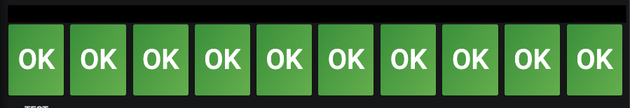

# Subdomain Health Lambda

This is a service responsible for passing HTTP status codes from multiple media endpoints and sending them to CloudWatch.


It queries the `/management/healthceck` endpoint of the provided endpoints in an S3 file and passes on the HTTP status codes to CloudWatch.
The structure of the `conf.json` file containing the endpoints is:
```json
{ "subdomains": [
    {
      "name": "some-subdomain",
      "endpoint": "http://some-subdomain.domain.com",
    },
    ...
  ]
}
```

This allows us to create dashboards like so:


### Deploying the service

This needs to be deployed as a standalone service in Riff Raff, by selecting the project `media-service::grid::subdomain-health-lambda` and the appropriate stage.
The package `node-riffraff-artefact` is responsible for building the Riff Raff artifact.

### Logs

Logs are sent to cloudwatch, which can then be shipped to ELK using [cloudwatch logs management](https://github.com/guardian/cloudwatch-logs-management)
